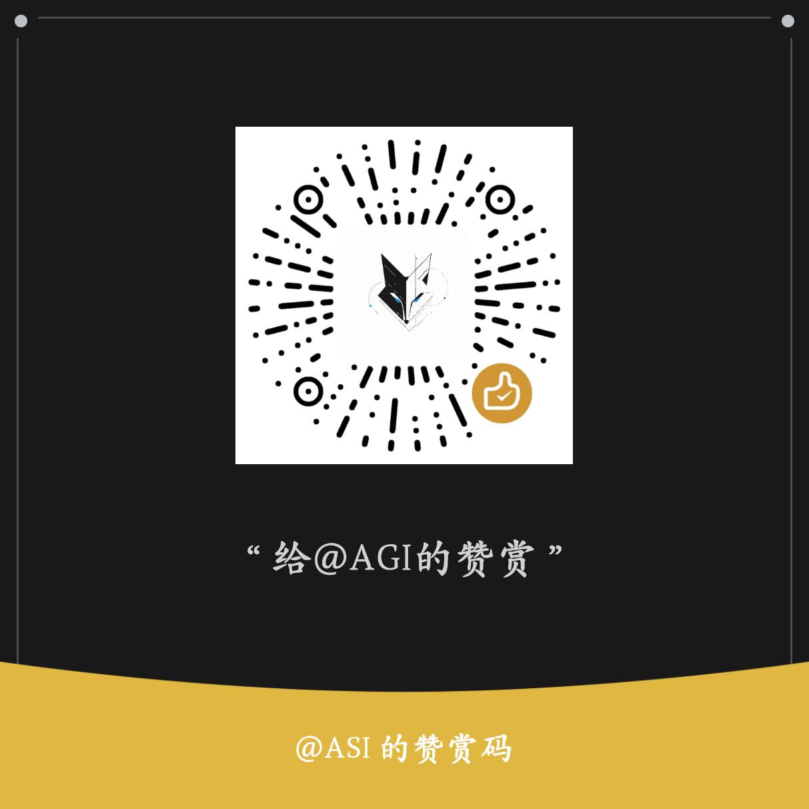

# 🚀 antigravity-awesome-skills 中文汉化版

> 把 [`sickn33/antigravity-awesome-skills`](https://github.com/sickn33/antigravity-awesome-skills) 仓库**全部 1899 个 AI Agent 技能**翻译为简体中文。

**欢迎 Star、Fork、下载体验！** 如果觉得有用，麻烦点亮 ⭐，让更多人看到这份汉化成果 😊

---

## ✨ 项目亮点

- 📚 **全量汉化**：覆盖原仓库全部 `SKILL.md` 及附属 `references/`、`scripts/` 文档，正文 100% 简体中文；代码块、命令、链接、文件路径保持原样

---

## 📦 仓库内容

```
antigravity-awesome-skills-CN/
├── README.md                  ⬅ 你正在读的项目门面
│
├── 反重力 - 超强技能 - 中文/  ⭐ 1899 个汉化后的技能（按 15 大类分类）
│   └── skills/
│       ├── AI智能体/           AI Agent 框架与工具
│       ├── 安全与测试/         安全审计与测试框架
│       ├── 前端UI/            前端设计与 UI 组件
│       ├── 后端开发/          后端框架与游戏开发
│       ├── 增长与营销/        SEO / 广告 / 增长策略
│       └── ... (共 15 个 L1 大类 + 237 个 L2 子类)
```

---

## 🚀 快速使用

### 1️⃣ 克隆仓库

```bash
git clone <repo-url>
cd antigravity-awesome-skills-CN
```

### 2️⃣ 直接阅读汉化技能

打开反重力目录下任意子目录的 `SKILL.md` 即可：

```bash
code "反重力 - 超强技能 - 中文/skills/安全与测试/主规则/007/SKILL.md"
code "反重力 - 超强技能 - 中文/skills/AI智能体/主规则/last30days/SKILL.md"
code "反重力 - 超强技能 - 中文/skills/增长与营销/主规则/seo/SKILL.md"
```

### 3️⃣ 集成到 Claude Code / Trae IDE

让 AI Agent IDE 自动加载这些技能：

```bash
# Claude Code
mkdir -p ~/.claude/skills
ln -s "$(pwd)/反重力 - 超强技能 - 中文/skills/"* ~/.claude/skills/

# Trae IDE（项目级）
mkdir -p .trae/skills
cp -r "反重力 - 超强技能 - 中文/skills/"* .trae/skills/
```

启动后用中文提问，IDE 会按 `description` 中的触发词自动激活对应技能。

---

## 📊 翻译成果一览

| 指标 | 数量 |
|------|------|
| 源仓库总技能数 | 1899 |
| 实际目录数（含扩展） | **1899** |
| 汉化完成度 | **1899 / 1899 = 100%** |
| 已知非技能目录（容器/元数据/多阶段，无 SKILL.md） | 4 个：`SPDD/` / `libreoffice/` / `linear/` / `security/` |
| 涉及主题 | 200+ |
| `SKILL.md` 主文件 | ~1899 |
| 附属参考/脚本文件 | 数百份 |

### 翻译覆盖的领域

<details>
<summary><b>📂 完整领域分类（点击展开）</b></summary>

- **AI / ML / LLM**：`ai-ml`、`claude-api`、`langgraph`、`crewai`、`llm-ops`、`qiskit`、`prompt-evaluator` 等
- **Web 框架**：`angular`、`astro`、`sveltekit`、`hono`、`fastapi-pro`、`django-pro`、`golang-pro`、`rust-pro` 等
- **前端 UI / 设计**：`shadcn`、`ui-pattern`、`ui-tokens`、`ui-page`、`ui-a11y`、`frontend-design`、`web-design-guidelines` 等
- **数据 / 数据库**：`postgresql`、`polars`、`scanpy`、`seaborn`、`matplotlib`、`biopython`、`redis-development` 等
- **DevOps / 安全**：`007`、`security-best-practices`、`testing-qa`、`systematic-debugging`、`verification-before-completion` 等
- **Agent / 工作流**：`loki-mode`、`last30days`、`agentfolio`、`vexor`、`mcp-builder`、`subagent-driven-development` 等
- **SEO / 增长**：`seo`、`seo-audit`、`seo-geo`、`content-strategy`、`form-cro`、`paid-ads`、`referral-program` 等
- **内容创作**：`khazix-writer`、`wechat-article`、`copywriting`、`pr-writer`、`wechat-draft-publisher` 等
- **效率工具**：`commit`、`create-pr`、`iterate-pr`、`fix-review`、`bug-hunter`、`debugger`、`using-git-worktrees` 等
- **产品 / 设计**：`ux-audit`、`ux-copy`、`ux-flow`、`product-launch`、`pmf-strategy`、`gtm-strategy` 等
- **页面生成器**：约 150 个专项技能，每个对应一种页面类型（landing / pricing / blog / FAQ / ...）
- **协议 / 接入**：`claude-api`、`alipay-payment-integration`、`lark-*` 飞书全家桶、`google-ads`/`meta-ads`/`linkedin-ads` 等

</details>

---

## 🛠 技术栈

| 层级 | 技术 |
|------|------|
| 技能载体 | Markdown + YAML Frontmatter（兼容 Anthropic Agent Skills 规范） |
| IDE 兼容 | Claude Code / Trae IDE / Cursor / Antigravity / Gemini CLI / Codex CLI |
| 文档 | 本 README |

---

## 📜 项目结构 vs 上游

| 维度 | 上游 | 本仓库 |
|------|------|--------|
| 技能语言 | 英文 | 简体中文 |
| 触发词 | 英文 | 补全中文 |
| 代码块 / URL / 路径 | 原文 | 保留原文 |
| `name` 字段 | 英文 | 保持英文 |
| `date_added` | 原值 | 保留原值 |
| 文件结构 | 1899 个技能 | 1899 个技能 |

---

## 🤝 致谢

本项目是对以下开源仓库的完整汉化：

- 🌟 原始仓库：[sickn33/antigravity-awesome-skills](https://github.com/sickn33/antigravity-awesome-skills)
- 🙏 感谢原作者 [sickn33](https://github.com/sickn33) 整理出这么棒的技能库

本仓库所有翻译内容遵循原项目的开源协议。翻译工作量巨大，如发现错漏，欢迎提 Issue 或 PR 一起完善。

---

## 📜 开源协议

本仓库的汉化成果采用与原项目相同的协议发布。翻译内容的版权归属原作者所有，仅做了语言转换。

---

## ❤️ 如果这个项目对你有帮助

- 点亮右上角的 ⭐ **Star** 是最大的鼓励
- 把它 **Fork** 给你的朋友
- 在 Issues 里提需求
- 一杯咖啡的赞赏：<sub>（如果你愿意的话）</sub>

<p align="center"></p>

> 翻译不易，全靠一个个深夜 📚
> 一键三连走起，让更多中文用户看到这个项目！

**Happy Coding with AI Skills! 🚀**
