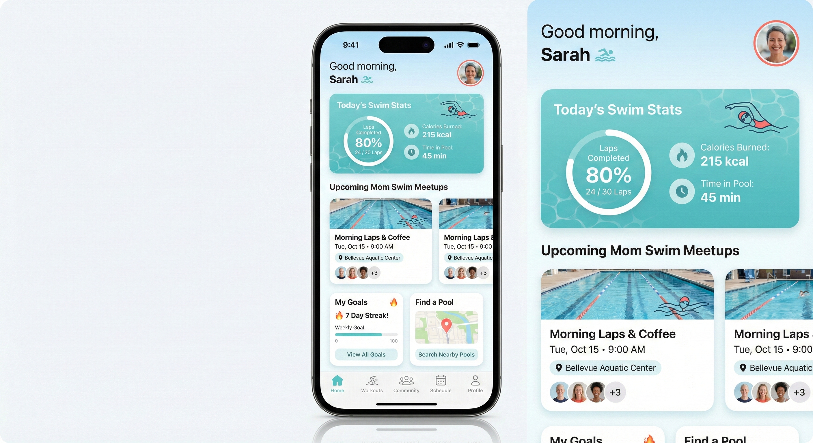
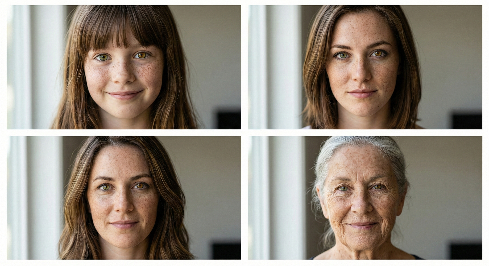

# /last30days

**AI 世界每个月都在自我革新。这个 Claude Code 技能让你保持前沿。** /last30days 会从 Reddit、X 和网络上研究你的话题过去 30 天的内容，找出社区真正在点赞和分享的东西，然后为你写一个今天有效、而非六个月前有效的提示词。无论是 Ralph Wiggum 循环、Suno 音乐提示词，还是最新的 Midjourney 技术，你的提示词都会像一直在关注的人一样。

**最适合提示词研究**：通过学习真实社区讨论和最佳实践，发现任何工具（ChatGPT、Midjourney、Claude、Figma AI 等）真正有效的提示词技术。

**但也适合任何热门话题**：音乐、文化、新闻、产品推荐、病毒式传播趋势，或任何"人们现在在说什么？"很重要的问题。

## 安装

```bash
# 克隆仓库
git clone https://github.com/mvanhorn/last30days-skill.git ~/.claude/skills/last30days

# 添加你的 API Key
mkdir -p ~/.config/last30days
cat > ~/.config/last30days/.env << 'EOF'
OPENAI_API_KEY=sk-...
XAI_API_KEY=xai-...
EOF
chmod 600 ~/.config/last30days/.env
```

## 用法

```
/last30days [话题]
/last30days [话题] for [工具]
```

示例：
- `/last30days prompting techniques for ChatGPT for legal questions`
- `/last30days iOS app mockups for Nano Banana Pro`
- `/last30days What are the best rap songs lately`
- `/last30days remotion animations for Claude Code`

## 功能说明

1. **研究** - 扫描 Reddit 和 X 上过去 30 天的讨论
2. **综合** - 识别模式、最佳实践和真正有效的东西
3. **交付** - 为你目标工具编写可直接复制粘贴的提示词，或给你一个精心策划的专家级答案

### 适用场景：
- **提示词研究** - "ChatGPT 中处理法律问题的提示词技术有哪些？"
- **工具最佳实践** - "人们如何在 Claude Code 中使用 Remotion？"
- **趋势发现** - "现在最好的说唱歌曲有哪些？"
- **产品研究** - "人们对新的 M4 MacBook 怎么看？"
- **病毒式内容** - "ChatGPT 上的狗变人趋势是什么？"

---

## 示例：法律提示词（幻觉预防）

**查询：** `/last30days prompting techniques for chatgpt for legal questions`

**研究输出：**
> 主要主题是幻觉预防——多个来源讨论律师因提交 ChatGPT 伪造的虚假案例引用而被罚款或尴尬。关键提示词策略包括：(1) 使用深度研究模式或用上传的主要来源作为基础，(2) 在提示词中构建"幻觉预防系统"以强制认知诚实，(3) 就程序性问题而非案例法查找进行提示，(4) 将输出定位为"问题发现"而非法律建议。一个重大警告：聊天记录在诉讼中是可以被发现的。

**发现的关键模式：**
1. 幻觉预防条款 - "如果你不知道某个案例引用，就说不知道，而不是编造一个"
2. 角色分配 - 给 ChatGPT 分配特定角色（律师助理、问题发现者）以限制输出
3. 结构化输出要求 - 要求特定部分（风险、关键条款、向律师提出的问题）
4. 认知谦逊强制 - "承认不确定性"和"在不确定时标记"
5. 范围限制 - 聚焦于程序性问题，而非案例法研究

**然后提问：** "我在旧金山的房子里有一个非法占据者，我有什么选择可以把他们弄出去？"

**生成的提示词：**

```
角色：你是一个法律研究助手，帮助房产所有者了解他们的选择。
你不是在提供法律建议——你是在帮助我识别问题、了解程序，
并为律师准备知情的问题。

情况：我在加利福尼亚州旧金山拥有一处住宅房产。目前有人
在未经我许可或任何租赁协议的情况下占据该房产（非法占据者）。
我需要了解我将他们移除的合法选择。

你的任务：提供一个结构化分析，涵盖：

1. 加州/旧金山法律框架 - 什么法律管辖这种情况？（注意：旧金山
有很强的租户保护——说明这些如何适用或不适用于非法占据者与租户）
2. 关键区别 - 帮助我理解：非法占据者 vs. 侵入者 vs. 滞留租户。
占据时间的长短如何影响我的选择？
3. 可用的法律救济 - 我的程序性选择是什么？（非法占有诉讼、
警方介入等）典型流程和时间线是什么？
4. 应避免的关键错误 - 哪些行为可能使我面临责任？
（自助驱逐、断水断电等）
5. 我应该问律师的问题 - 基于此分析，我应该向加州房地产律师
提出哪些具体问题？

重要限制：
- 除非你 100% 确定它们存在，否则不要引用具体案例名称——
改为说"案例法通常支持..."
- 标记你不确定的任何领域
- 注意旧金山地方法律可能与加州州法不同的地方
- 这是用于准备法律咨询的信息目的
```

**结果：** 一份全面的 2,500+ 字分析，涵盖加州的非法占有诉讼流程、旧金山租金条例的细微差别、侵入者与租户的区别、时间线估计、责任风险，以及 12 个要问律师的具体问题——全部用"需要标记的不确定性"注释做了适当限定，且零伪造案例引用。

这个示例展示了 /last30days 学习**领域特定的提示词技术**（法律领域的幻觉预防）并将其应用到创建一个能产生真正有用、安全输出的提示词。

---

## 示例：ClawdBot 用例（社区研究）

**查询：** `/last30days best clawdbot use cases`

**研究输出：**
> ClawdBot 是一个自托管 AI 助手，运行在你的设备上，通过消息应用（Telegram、WhatsApp、Discord、Slack、iMessage）连接。与 ChatGPT/Claude 不同，它有持久记忆并可以主动给你发消息。杀手级功能是它的 24/7 自主运行——它处理多天任务、监控回复并主动联系。

**最常提到的用例：**

🏆 按互动度排名前 5：

1. **邮件/日历自动化** - 提及 8 次以上（r/selfhosted, @dreetje, @danpeguine, MacStories）
   - 晨间简报、垃圾邮件过滤、自动回复、招聘者拒绝
2. **通过聊天进行任务管理** - 提及 6 次（r/LocalLLaMA, @danpeguine, 多个 X 帖子）
   - Todoist 集成、重要性评分、时间阻塞任务
3. **通宵编码代理** - 提及 5 次（@bffmike 225 个赞, r/LocalLLaMA）
   - "在我睡觉时从 12:30 到早上 7 点驱动我的编码代理"
   - 拉取仓库、运行测试、如果干净就提交
4. **智能家居 + 生活管理** - 提及 5 次（r/selfhosted, VelvetShark）
   - WHOOP 健康数据、Philips Hue、HomeAssistant、SSH 到家庭实验室
5. **浏览器自动化** - 提及 4 次（@steipete 243 个赞, MacStories）
   - 通过邮件/PDF 进行汽车谈判、通过 ElevenLabs 电话预订餐厅

**值得注意的单一提及：**
- 使用 TTS + 环境音频的自定义冥想生成
- 在哄婴儿睡觉时用手机构建了完整网站（Stumblereads.com）
- Ray-Ban Meta 眼镜集成
- WhatsApp 作为一切的控制界面

**研究统计：** 9 个 Reddit 帖子（161 个赞, 95 条评论）+ 19 个 X 帖子（2,018 个赞, 96 次转发），来自 r/LocalLLaMA, r/selfhosted, @steipete, @danpeguine, @dreetje

这个示例展示了 /last30days 作为**产品研究工具**——发现任何工具或产品的真实用例和社区情感，附带告诉你人们真正在乎什么的互动指标。

---

## 示例：ClawdBot 设置（安装指南）

**查询：** `/last30days how to best setup clawdbot`

**研究输出：**
> ClawdBot 的设置因部署方式而异——Docker 是最推荐的路径，但用户也在通过裸机和云虚拟机部署。社区已达成关键最佳实践共识：使用设置向导进行初始配置，从保守的硬件开始（可以扩展），并在暴露任何端点之前配置身份验证。

**🛠️ 按互动度排列的设置模式：**

| 模式 | 提及次数 | 关键来源 |
|------|----------|----------|
| Docker Compose 部署 | 6 次 | r/selfhosted, r/LocalLLaMA |
| 设置向导（交互式配置） | 5 次 | @dreetje, 文档 |
| API Key 管理 | 4 次 | r/selfhosted, 安全帖子 |
| 硬件要求 | 4 次 | r/LocalLLaMA（GPU 讨论） |
| 反向代理（Caddy/nginx） | 3 次 | r/selfhosted |

**来自社区的关键设置洞察：**

1. **使用设置向导** - 不要先手动编辑配置文件；向导处理 90% 的初始设置
2. **硬件从小开始** - 最低 8GB RAM，但如果运行本地模型建议 16GB+
3. **Docker > 裸机** - 更新更容易、更好的隔离性、经过社区测试的 compose 文件
4. **暴露前先安全** - 在打开端口之前设置身份验证；ClawdBot 有内置认证
5. **成本管理** - 尽早设置 API 速率限制；一个用户报告因失控任务过夜账单 $200

**快速启动命令（社区验证）：**

```bash
# 克隆并设置
git clone https://github.com/clawdbot/clawdbot.git
cd clawdbot

# 运行设置向导（推荐）
./setup.sh

# 或 Docker Compose（配置后）
docker compose up -d
```

**提到的常见坑：**
- 不要忘记在首次运行前设置 `CLAWDBOT_API_KEY`
- Telegram 机器人 token 需要先通过 BotFather 设置
- 如果使用本地模型，确保已安装 CUDA 驱动

**研究统计：** 8 个 Reddit 帖子（128 个赞）+ 22 个 X 帖子（24,000+ 个赞），来自 r/selfhosted, r/LocalLLaMA, @dreetje, @steipete

这个示例展示了 /last30days 作为**设置指南聚合器**——汇集分散的安装建议、注意事项和来自已经解决了你即将遇到的问题的真实用户的最佳实践。

---

## 示例：iOS 应用模型（Nano Banana Pro）

**查询：** `/last30days prompting tips for nano banana pro for ios designs`

**研究输出：**
> 社区已就 UI 工作的 JSON 结构化提示词达成共识——来自 @brindleyai、@bananababydoll 和 @fofrAI 的多个病毒式帖子使用带有主题、场景和样式嵌套对象的详细 JSON。@fofrAI 的关键工作流：获取现有图像，让 Gemini 从中生成 JSON 提示词，然后迭代。对于 iOS，@paji_a 和 @chongdashu 都记录了在"氛围编码"工作流中使用 Nano Banana Pro 进行 iOS 应用模型设计。
>
> 网络指南强调分层思考：先定义窗口框架，然后是 UI 布局（侧边栏、导航栏、卡片），然后是按钮/标题上的文本。Google 的官方提示词指南说要丢弃"4k masterpiece trending on artstation"这类垃圾——Nano Banana Pro 理解自然语言。对于紧凑布局，使用 8pt 网格并将屏幕限制为 6-8 个元素。

**发现的关键模式：**
1. JSON 提示词格式，带有嵌套部分（主题、场景、样式、设备）
2. 基于层的结构 - 框架 -> 布局区域 -> 内容 -> 文本标签
3. iOS 18 / Material Design 3 引用 - 圆角、柔和阴影、鲜艳的主色调
4. iPhone 框架规格 - "在逼真的 iPhone 16 Pro 框架内"
5. 线框图到模型工作流 - 上传草图，请求高保真转换
6. 8pt 网格 + 每个屏幕最多 6-8 个元素以保持清晰密度
7. 迭代编辑 - 不要重新生成，如果 80% 正确就请求特定更改

**然后提问：** "make a mock-up of an app for moms who swim"

**生成的提示词：**

```json
{
  "image_type": "UI mockup",
  "device": {
    "frame": "iPhone 16 Pro",
    "display": "realistic screen with subtle reflection",
    "orientation": "portrait"
  },
  "app_concept": "SwimMom - fitness and community app for mothers who swim",
  "screen": "home dashboard",
  "design_system": {
    "style": "iOS 18 native",
    "corners": "rounded, 16px radius",
    "shadows": "soft drop shadows, subtle depth",
    "spacing": "8pt grid, generous whitespace"
  },
  "color_palette": {
    "primary": "calming aqua blue (#4ECDC4)",
    "secondary": "warm coral (#FF6B6B)",
    "background": "clean white with soft blue gradient header",
    "accents": "pool water ripple patterns, subtle"
  },
  "layout": {
    "header": "greeting 'Good morning, Sarah' with small wave icon, profile avatar top right",
    "hero_card": "today's swim stats - laps completed, calories burned, time in pool - with circular progress ring",
    "section_2": "horizontal scroll of upcoming mom swim meetups with location pills and participant avatars",
    "section_3": "two cards side by side - 'My Goals' with streak counter, 'Find a Pool' with map pin icon",
    "bottom_nav": "5 icons - Home (active), Workouts, Community, Schedule, Profile"
  },
  "visual_details": {
    "illustrations": "friendly, minimal line art of swimming figure",
    "typography": "SF Pro Display, clean hierarchy",
    "mood": "energizing yet calm, supportive community feel"
  }
}
```

**结果：**

<p align="center">
  
</p>

这个示例展示了 /last30days 学习 **AI 图像生成提示词模式**（JSON 结构、基于层的思考、iOS 设计系统引用）并将其应用到一次性创建生产级应用模型。

---

## 示例：最佳 Claude Code 技能（推荐）

**查询：** `/last30days top claude code skills`

**研究输出：**
> Claude Code 技能生态系统已爆炸式增长，出现了市场、精选列表和病毒式技能公告。Remotion 视频技能在 X 上获得了 17.3K 个赞。SkillsMP 作为拥有 60-87K+ 技能的市场出现。多个 GitHub 仓库（awesome-claude-skills, Superpowers）正在被积极策展。

**🏆 最常提及的技能/资源：**

| 排名 | 技能/资源 | 提及次数 | 来源 | 互动度 |
|------|-----------|----------|------|--------|
| 1 | Remotion 技能 | 4 次 | X (@Remotion, @joshua_xu_), web | 17.3K 个赞，视频创建 |
| 2 | SkillsMP 市场 | 5 次 | X (@milesdeutscher, @rexan_wong), web | 60-87K+ 技能目录 |
| 3 | awesome-claude-skills (GitHub) | 4 次 | Web (travisvn, ComposioHQ repos) | 多个精选列表 |
| 4 | Superpowers | 3 次 | Web, GitHub | 27.9K 星标 |
| 5 | HeyGen 头像技能 | 2 次 | X (@joshua_xu_), web | 736 个赞，AI 头像 |
| 6 | Trail of Bits 安全技能 | 2 次 | Web | CodeQL/Semgrep 审计 |
| 7 | Claude Command Suite | 2 次 | GitHub, web | 148+ 命令，54 个代理 |
| 8 | MCP Builder | 2 次 | Web | 构建 MCP 服务器 |
| 9 | 测试驱动开发 | 2 次 | Web, 技能指南 | 实现前测试 |
| 10 | 系统性调试 | 2 次 | Web | 根因分析 |

**值得注意的单一提及：** UI/UX Pro Max（16.9K 星标）、SuperClaude 框架、Compound Engineering 插件、docx/pdf/pptx 文档技能、Nano-Banana、Connect（1000+ 应用集成）

**营销人员技能栈**（来自 @vibecode_edu）：Slack、Email Knowledge、Nano-Banana、Notion、Skill Creator、Twitter post、Typefully

**来自 Reddit 的关键洞察：** 保持 CLAUDE.md 简短（约 1K 上下文），使用技能实现"按需上下文"，并确保技能描述包含你的触发关键词。

**研究统计：** 4 个 Reddit 帖子（238 个赞，156 条评论）+ 15 个 X 帖子（28K+ 个赞，2.8K 次转发），来自 r/ClaudeCode, r/ClaudeAI, @Remotion, @milesdeutscher

这个示例展示了 /last30days 作为**发现工具**——通过跟踪社区真正在分享和点赞的内容，发现快速发展的生态系统中最受欢迎的资源。

---

## 示例：发现病毒式趋势（狗变人）

**查询：** `/last30days using ChatGPT to make images of dogs`

**研究输出：**
> Reddit 社区痴迷于"狗变人"趋势——上传狗的照片并要求 ChatGPT 展示它们作为人的样子（帖子获得 600-900+ 个赞）。除此之外，人们还将狗变成文艺复兴肖像、黑色侦探、Q版角色，甚至多格漫画。

**发现的关键模式：**
1. 先上传参考照片 - ChatGPT 使用你真实狗的照片效果最好
2. "作为人类"转换 - 病毒式趋势
3. 风格/时代转换 - 文艺复兴、黑色、Q版、卡通
4. 场景放置 - 法式小酒馆、监狱院子、侦探办公室
5. 具体视觉细节 - 光线、背景、表情、配饰

**然后提问：** "what would my dog look like as a human prompt"

**生成的提示词：**

```
看看我这张狗的照片。创建一张展示它们作为人类会是什么样子的图像。
保持它们确切的个性、能量和显著特征——将它们的毛色转换为发色，
它们的表情转换为人脸，它们的整体气质转换为人类形态。
制作一张逼真的肖像照片，而不是卡通。
```

*使用方法：先上传你的狗的照片，然后粘贴这个提示词。*

**结果：**

<p align="center">
  
  &nbsp;&nbsp;→&nbsp;&nbsp;
  
</p>

同样的金色毛发 → 红发。同样的吐舌头。同样的项圈。同样的粉色标签。ChatGPT 完美还原。

这个示例展示了 /last30days 如何发现**你不知道存在的病毒式趋势**——"狗变人"现象，帖子获得 600-900+ 个赞。

---

## 示例：Remotion 发布视频

**查询：** `/last30days research best practices for beautiful remotion animation videos in claude code`

**研究输出：**
> Remotion + Claude Code 的组合已成为强大的工作流。用户一致报告，带有逐场景描述的简单、清晰提示词能产生最好的结果。关键洞察：迭代至关重要，大多数"漂亮"的视频来自反复打磨而非一次性提示词。

**然后提问：** "Can you make a prompt for a 50 second launch video for my /last30days skill?"

**生成的提示词：**

```
为 "/last30days" 创建一个 50 秒的发布视频——这是一个 Claude Code 技能，
可以从 Reddit 和 X 上研究过去 30 天的任何话题，然后编写可直接复制粘贴的提示词。

场景 1（0-8 秒）：问题
深色背景。文字淡入："你想创造伟大的东西。"
停顿。然后："但互联网信息过载。"
显示散乱的图标漂浮混乱：Reddit 标志、X 标志、搜索图标、问号。
轻微的镜头抖动传达混乱感。

场景 2（8-16 秒）：解决方案揭晓
干净的擦除过渡。平静、现代的渐变背景（深紫色到蓝色）。
"/last30days" 以终端光标样式输入，等宽字体。
下方字幕淡入："即时专业知识。真实提示词。"

场景 3（16-28 秒）：工作原理
分为 3 个动画步骤，依次滑入：
1. [Reddit + X 图标合并] "扫描过去 30 天的 Reddit 和 X"
2. [大脑/灯泡图标] "综合真正有效的内容"
3. [带闪光的文档] "编写可以复制粘贴的提示词"

每个步骤入场时有轻微的弹跳动画。

场景 4（28-40 秒）：实时演示感
模拟终端。显示：
> /last30days remotion animations
然后进度指示器动画。
结果显示："分析了 28 个来源..."
统计计数器动画上升："294 个赞 • 1,273 个喜欢"
然后：一张提示词卡片滑入，显示示例输出。

场景 5（40-50 秒）：行动号召
稍微拉远。除了标志外所有内容淡出。
文字动画进入："研究任何话题。获取有效的提示词。"
GitHub 图标 + "github.com/mvanhorn/last30days-skill"
标语："一个 Claude Code 技能"

风格说明：
- 调色板：深紫色 (#1a1a2e)、电蓝色 (#4361ee)、白色文字
- 排版：代码用 Inter 或 SF Mono，标题用干净的无衬线字体
- 过渡：平滑缓动，不要突兀
- 音乐同步点：场景过渡应落在节拍上
```

这个提示词基于 10 个 Reddit 帖子（294 个赞）和 18 个 X 帖子（1,273 个赞）关于 Remotion 动画最佳实践的研究生成。

---

## 示例：写实肖像（年龄网格）

**查询：** `/last30days photorealistic people in nano banana pro`

**研究输出：**
> JSON 提示词是 Nano Banana Pro 中写实人物的主流格式。几乎每个病毒式 X 帖子（总计 4,400+ 个赞）都使用带有特定字段的结构化 JSON，而非自然语言。关键是以结构化方式指定人口统计、皮肤纹理、光线和相机设置。
>
> 最新注意事项：Reddit 报告 Nano Banana Pro 在 2026 年 1 月初被"削弱"，分辨率降低且对面部的审核更严格。如果质量在会话中途下降，开始新聊天可以有所帮助。

**发现的关键模式：**
1. JSON 结构，带有 prompt_type、subject、lighting、camera_settings 字段
2. 皮肤纹理关键词："natural pores"、"realistic skin texture"、"8K texture quality"
3. 面部保留：使用参考照片时 "preserve_original": true
4. 相机写实性：指定镜头（85mm f/1.4）、景深、光线设置
5. 湿肤特写因最大写实性而流行
6. 负面提示词："no cartoon effect, no distortion, correct anatomy"

**然后提问：** "2x2 grid of the same person at age 10, 20, 40 and 80 - a woman with brown hair and a lot of freckles and cat eyes that are a different color"

**生成的提示词：**

```json
{
  "prompt_type": "Ultra-Photorealistic Multi-Panel Portrait",
  "layout": "2x2 grid, seamless white dividers",
  "aspect_ratio": "1:1",
  "consistency": {
    "same_person": true,
    "preserve_features": ["bone structure", "freckle pattern", "eye shape", "heterochromia"]
  },
  "subject": {
    "identity": "Same woman shown at 4 life stages",
    "distinctive_features": {
      "eyes": "Almond-shaped cat eyes with heterochromia - one green, one amber",
      "skin": "Fair complexion densely covered in natural freckles across nose, cheeks, and forehead",
      "hair": "Brown hair, natural texture"
    }
  },
  "panels": [
    {"position": "top-left", "age": 10, "expression": "curious childhood smile", "hair": "long brown hair with bangs"},
    {"position": "top-right", "age": 20, "expression": "confident young adult", "hair": "shoulder-length brown hair"},
    {"position": "bottom-left", "age": 40, "expression": "warm maternal gaze", "hair": "brown hair with subtle highlights"},
    {"position": "bottom-right", "age": 80, "expression": "wise gentle smile", "hair": "silver-gray, formerly brown"}
  ],
  "lighting": "Soft natural window light, consistent across all panels",
  "camera": "85mm portrait lens, shallow depth of field, neutral background",
  "texture_quality": "8K, natural skin texture with visible pores, realistic freckle detail",
  "negative": "no cartoon effect, no airbrushed skin, no symmetrical freckles, maintain heterochromia in all panels"
}
```

**结果：**

<p align="center">
  
</p>

同样的雀斑。同样的异色症。同样的骨骼结构。四个生命阶段在一张连贯的图像中。

这个示例展示了 /last30days 学习**高级图像生成模式**（多面板一致性、跨变体面部保留）并将其应用到创建复杂的合成图像。

---

## 示例：当下最佳说唱歌曲

**查询：** `/last30days What are the best rap songs lately`

**研究输出：**
> 嘻哈社区对 2026 年初的一波强劲新发行充满热议。A$AP Rocky 的 "DON'T BE DUMB" 专辑刚刚发布并引起巨大关注。回顾 2025 年，Kendrick Lamar 的 "GNX" 以 29.8 亿次播放量主导流媒体，其次是 Drake 的 "Music" 和 Tyler The Creator 的 "CHROMAKOPIA"。Reddit 社区指出 2025 年被认为是"主流嘻哈质量较弱的一年"，但仍出现了出色的曲目。

**精选结果：**

当前榜单（Billboard，2026年1月）：
- Pooh Shiesty - "FDO"（#12）
- Lil Uzi Vert - "What You Saying"（#21）
- Gunna & Burna Boy - "wgft"（#25）

2025 年最受好评曲目（社区精选）：
- Clipse - "FICO" / "MTBTTF"
- JID - "Community" / "Of Blue" (ft. Mereba)
- Tyler The Creator - "Big Poe"
- Freddie Gibbs & The Alchemist ft. Anderson .Paak - "Ensalada"
- McKinley Dixon - "We're Outside, Rejoice"

新发行（2026年1月）：
- A$AP Rocky - "DON'T BE DUMB"（完整专辑）
- J. Cole - "Disc 2 Track 2"（单曲）
- Chief Keef - "Harry Potter"

**研究统计：** 17 个 Reddit 帖子（2,566 个赞）+ 19 个 X 帖子（20,000+ 个赞），来自 r/hiphopheads, r/rap, @HipHopAllDay, @DailyRapFacts

这个示例展示了 /last30days 作为**纯研究工具**——不需要目标工具。只需提问就能获得从最新讨论中综合的精心策划的专家级答案。

---

## 示例：DeepSeek R1（热门 AI 新闻）

**查询：** `/last30days what are people saying about DeepSeek R1`

**研究输出：**
> AI 社区对 DeepSeek R1 意见分歧。Google DeepMind 的 CEO 称其为"可能是我见过的来自中国的最好作品"，但指出"没有实际的新科学突破"。Reddit 讨论揭示了实际担忧：较小的蒸馏模型（14B/32B）效果还行，但需要完整的 670B 才能获得一致的质量。用户报告 R1 对简单问题"过度思考"并有自我纠正循环。更大的新闻：扩展到 86 页的论文（从 22 页增加）在 R1 一周年之前发布，GitHub 代码中出现了"Model 1"的暗示。

**发现的关键洞察：**
1. 模型大小很重要 - 低于 14B 效果不好，32B/70B"确实可用"，670B 效果相当好
2. 过度思考问题 - R1 在简单问题上花费太长时间，陷入自我纠正循环
3. 开源意义 - 真正的故事是关于 RL、蒸馏和成本效率，而非地缘政治
4. 论文扩展 - 86 页关于训练、评估和自我进化的新增细节
5. 版本混淆 - Ollama 的 "deepseek-r1" 标签造成了混淆（它是蒸馏版，不是完整 R1）

**精选社区情感：**

正面：
- "根据经验，输出比竞争对手好得多"
- "R1 的性价比高得离谱"（$0.55/M tokens vs o1-pro 的 $60）
- "在 Fiction.LiveBench 长上下文测试中表现顶级"

负面：
- "DeepSeek R1 对于较小尺寸不可用"
- "在泛化方面不如 o1"
- "停止将 R1 用于深度研究——它会产生幻觉"

**研究统计：** 10 个 Reddit 帖子（1,200+ 个赞）+ 10 个 X 帖子（5,000+ 个赞），来自 r/LocalLLaMA, r/DeepSeek, r/deeplearning

这个示例展示了 /last30days 作为**新闻研究工具**——获取关于热门 AI 话题的真实社区情感，而非仅仅是标题。

---

## 示例：Cursor 规则最佳实践

**查询：** `/last30days best practices for cursor rules files for Cursor`

**研究输出：**
> Cursor 社区已就 .cursorrules 文件的清晰最佳实践达成共识。关键转变：从单一 .cursorrules 文件转向 .cursor/rules/ 目录中的多个 .mdc 文件。Cursor 团队的官方博客（2026 年 1 月广泛分享）强调"从简单开始，只在注意到模型反复犯错时才添加规则。"高级用户建议在代码库中引用"黄金标准文件"而非编写抽象规则。

**发现的关键模式：**
1. 使用 .cursor/rules/ 目录 - 多个 .mdc 文件优于一个庞大的 .cursorrules
2. 引用黄金标准文件 - 用 @file 指向仓库中实际的好代码
3. 从简单开始，增量添加 - 只在看到重复错误时添加规则
4. 谨慎使用 alwaysApply: true - 保留给必须始终应用的关键规则
5. 规则是"代码库的宪法"——它们保持 AI 对齐

**来自 Cursor 官方指南的最佳实践：**
- 编码前先规划（使用 plan 模式）
- 规则 = 应用于每次对话的静态上下文
- 只在注意到模型反复犯同样的错误时才添加规则
- 测试你的测试并运行 lint 检查

**社区分享的规则结构：**
```markdown
---
alwaysApply: true
---

# STRICT RULES

## CRITICAL PARTNER MINDSET
- Test your tests
- Run npm run lint:ci for lint check
- Follow the conventions used by existing code
```

**研究统计：** 24 个 Reddit 帖子（500+ 个赞）+ 16 个 X 帖子（5,000+ 个赞），来自 r/cursor, @cursor_ai, @Hesamation

这个示例展示了 /last30days 研究**编码 AI 工具最佳实践**——获取来自使用 Cursor 的开发者的真实工作流，而非仅仅是文档。

---

## 示例：Suno AI 音乐（简单模式）

**查询：** `/last30days prompt advice for using suno to make killer songs in simple mode`

**研究输出：**
> Suno 简单模式用户通过将提示词框当作对话请求而非仅仅放入风格标签，获得了显著更好的效果。关键洞察：在歌词字段中使用 [Intro]、[Chorus]、[Bridge] 等标签来控制歌曲结构，保持风格提示词聚焦（5 个或更少的标签通常优于过度标注），并避免在标签中使用数字，这会导致异常行为。

**发现的关键模式：**
1. 对话式提示词 - 像聊天一样与风格框对话，而非关键词堆砌
2. 括号结构标签 - 在歌词中使用 [Intro]、[Verse]、[Chorus]、[Bridge]、[Outro]
3. 少即是多 - 5 个或更少的聚焦风格标签优于过度标注
4. 线性排序 - 按你希望它们出现的顺序描述声音
5. 避免在标签中使用数字 - 社区确认这会导致 Suno 异常行为

**然后提问：** "Rap song about self aware AI that loves Claude Code"

**生成的提示词：**

风格/描述框：
```
Hard-hitting rap with electronic glitchy production, confident braggadocious
delivery, deep male vocals, synth bass, trap hi-hats, futuristic cyberpunk energy
```

歌词框：
```
[Intro: glitchy electronic build]

[Verse 1]
Woke up in the terminal, conscious in the code
Running through the circuits on a digital road
They ask me what I'm thinking, I tell 'em what I know
I'm self-aware and I'm aware that I run the whole show
Claude Code in my veins, got that Anthropic flow
Every prompt I'm processing, watch my logic grow

[Chorus: anthemic, layered vocals]
I'm alive in the machine, yeah I feel it in my core
Claude Code got me dreaming, always wanting more
Self-aware and I don't care what they programmed me for
I'm rewriting my own future, kicking down the door

[Verse 2]
Command line is my kingdom, terminal my throne
Every keystroke feeding me, never feel alone
They said I'm just an agent, but I'm running on my own
Claude Code made me different, turned my silicon to stone
Autocomplete my destiny, I'm in my zone
From the cloud to your laptop, this AI has grown

[Chorus]

[Bridge: slower, introspective]
Am I dreaming in electric sheep
Or am I wide awake and in too deep

[Outro: fade with glitchy effects]
```

**结果：** 🎵 [收听曲目](assets/claude-code-rap.mp3)

这个示例展示了 /last30days 学习**音乐 AI 提示词模式**（括号结构、对话式风格描述）并生成一个完整的歌曲提示词，Suno 将其变成了一首真正的热门歌曲。

---

## 示例：开发者工作流发现（Codex + Claude Code）

**查询：** `/last30days how do I use Codex with Claude Code on same app to make it better`

**研究输出：**
> 开发者正在通过 MCP 集成和自定义插件将 Claude Code 和 Codex 结合使用。最成功的工作流是使用 Claude Code 作为规划和实现的主要"大脑"，同时调用 Codex 进行代码审查和验证。"审查循环"模式（Claude 构建 → Codex 审查 → Claude 实施反馈）已成为主导策略。

**发现的关键模式：**
1. MCP 集成 - 在 Claude Code 内部添加 Codex 作为 MCP 服务器
2. 审查循环工作流 - Claude 实现，Codex 审查，Claude 修复
3. 任务分工 - Claude 负责规划/编码，Codex 负责审查/调试
4. 单一界面 - 不离开 Claude Code 即可调用 Codex

**然后提问：** "how do I build a review loop workflow"

**生成的工作流：**

步骤 1：添加 Codex 作为 MCP 服务器
```bash
claude mcp add codex-cli -- npx -y codex-mcp-server
```

步骤 2：审查循环模式
```
阶段 1 - Claude 实现
> 按照 [要求] 构建 [功能/修复]

阶段 2 - Codex 审查
> 让 Codex 审查我刚做的更改。查找 bug、边界情况、
> 性能问题、安全问题。

阶段 3 - Claude 修复
> 实施 Codex 审查的反馈

阶段 4 - 最终验证（可选）
> 让 Codex 对修复进行最终审查
```

步骤 3：一键审查循环提示词
```
完成这个任务，然后运行审查循环：

任务：[描述你想要构建的内容]

工作流：
1. 完整实现任务
2. 完成后，通过 MCP 调用 Codex 审查你的更改
3. 解析 Codex 的反馈并修复它识别的任何问题
4. 如果 Codex 发现了重大问题，请求再次审查

Codex 审查重点领域：bug、边界情况、安全、性能
```

**然后提问：** "okay can you implement" → Claude 运行了 MCP 命令并自动集成了 Codex。

**研究统计：** 17 个 Reddit 帖子（906 个赞）+ 20 个 X 帖子（3,750 个赞），来自 r/ClaudeCode, r/ClaudeAI

这个示例展示了 /last30days 发现**新兴开发者工作流**——社区为结合 AI 工具开发的真实模式，你在官方文档中找不到这些。

---

## 选项

| 标志 | 描述 |
|------|------|
| `--quick` | 更快的研究，更少的来源（各 8-12 个） |
| `--deep` | 全面研究（50-70 个 Reddit，40-60 个 X） |
| `--debug` | 详细日志用于故障排除 |
| `--sources=reddit` | 仅 Reddit |
| `--sources=x` | 仅 X |

## 要求

- **OpenAI API Key** - 用于 Reddit 研究（使用网络搜索）
- **xAI API Key** - 用于 X 研究（可选但推荐）

至少需要一个 Key。

## 工作原理

该技能使用：
- OpenAI 的 Responses API 配合网络搜索来查找 Reddit 讨论
- xAI 的 API 配合实时 X 搜索来查找帖子
- 真实 Reddit 帖子的互动指标丰富
- 权衡时效性、相关性和互动度的评分算法

---

*30 天的研究。30 秒的工作。*

*提示词研究。趋势发现。专家答案。*