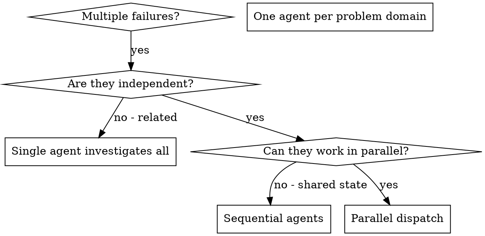

# 调度并行智能体

## 概述

当你有多个不相关的失败（不同的测试文件、不同的子系统、不同的 bug）时，逐个调查会浪费时间。每个调查都是独立的，可以并行进行。

**核心原则：** 每个独立的问题域分派一个智能体。让它们并发工作。

## 何时使用


**使用场景：**
- 3 个以上测试文件因不同根因而失败
- 多个子系统独立损坏
- 每个问题可以在不了解其他问题上下文的情况下理解
- 调查之间没有共享状态

**不要使用：**
- 失败是相关的（修复一个可能会修复其他）
- 需要了解完整的系统状态
- 智能体会相互干扰

## 模式

### 1. 识别独立域

按损坏的内容对失败进行分组：
- 文件 A 测试：工具审批流程
- 文件 B 测试：批处理完成行为
- 文件 C 测试：中止功能

每个域都是独立的——修复工具审批不会影响中止测试。

### 2. 创建聚焦的智能体任务

每个智能体获得：
- **具体范围：** 一个测试文件或子系统
- **明确目标：** 让这些测试通过
- **约束条件：** 不要修改其他代码
- **预期输出：** 你发现和修复内容的摘要

### 3. 并行分派

```typescript
// In Claude Code / AI environment
Task("Fix agent-tool-abort.test.ts failures")
Task("Fix batch-completion-behavior.test.ts failures")
Task("Fix tool-approval-race-conditions.test.ts failures")
// All three run concurrently
```

### 4. 审查和集成

当智能体返回时：
- 阅读每个摘要
- 验证修复不冲突
- 运行完整测试套件
- 集成所有更改

## 智能体提示词结构

好的智能体提示词应该：
1. **聚焦** - 一个明确的问题域
2. **自包含** - 理解问题所需的所有上下文
3. **明确输出** - 智能体应该返回什么？

```markdown
Fix the 3 failing tests in src/agents/agent-tool-abort.test.ts:

1. "should abort tool with partial output capture" - expects 'interrupted at' in message
2. "should handle mixed completed and aborted tools" - fast tool aborted instead of completed
3. "should properly track pendingToolCount" - expects 3 results but gets 0

These are timing/race condition issues. Your task:

1. Read the test file and understand what each test verifies
2. Identify root cause - timing issues or actual bugs?
3. Fix by:
   - Replacing arbitrary timeouts with event-based waiting
   - Fixing bugs in abort implementation if found
   - Adjusting test expectations if testing changed behavior

Do NOT just increase timeouts - find the real issue.

Return: Summary of what you found and what you fixed.
```

## 常见错误

**❌ 太宽泛：** "Fix all the tests" - 智能体会迷失方向
**✅ 具体：** "Fix agent-tool-abort.test.ts" - 聚焦的范围

**❌ 没有上下文：** "Fix the race condition" - 智能体不知道在哪里
**✅ 有上下文：** 粘贴错误消息和测试名称

**❌ 没有约束：** 智能体可能会重构所有内容
**✅ 有约束：** "Do NOT change production code" 或 "Fix tests only"

**❌ 模糊的输出：** "Fix it" - 你不知道改了什么
**✅ 明确输出：** "Return summary of root cause and changes"

## 何时不使用

**相关的失败：** 修复一个可能会修复其他——先一起调查
**需要完整上下文：** 理解需要查看整个系统
**探索性调试：** 你还不知道哪里坏了
**共享状态：** 智能体会相互干扰（编辑相同的文件，使用相同的资源）

## 会话中的真实示例

**场景：** 大规模重构后 3 个文件中有 6 个测试失败

**失败：**
- agent-tool-abort.test.ts: 3 个失败（时序问题）
- batch-completion-behavior.test.ts: 2 个失败（工具未执行）
- tool-approval-race-conditions.test.ts: 1 个失败（执行计数 = 0）

**决策：** 独立域——中止逻辑与批处理完成与竞态条件分离

**分派：**
```
Agent 1 → Fix agent-tool-abort.test.ts
Agent 2 → Fix batch-completion-behavior.test.ts
Agent 3 → Fix tool-approval-race-conditions.test.ts
```

**结果：**
- Agent 1: 用基于事件的等待替换超时
- Agent 2: 修复事件结构 bug（threadId 放错位置）
- Agent 3: 添加等待异步工具执行完成

**集成：** 所有修复独立，无冲突，完整套件通过

**节省时间：** 并行解决 3 个问题 vs 顺序解决

## 关键收益

1. **并行化** - 多个调查同时进行
2. **聚焦** - 每个智能体范围狭窄，需要跟踪的上下文更少
3. **独立性** - 智能体之间不相互干扰
4. **速度** - 在 1 个问题的时间内解决 3 个问题

## 验证

智能体返回后：
1. **审查每个摘要** - 了解更改了什么
2. **检查冲突** - 智能体是否编辑了相同代码？
3. **运行完整套件** - 验证所有修复一起工作
4. **抽查** - 智能体可能会犯系统性错误

## 真实影响

来自调试会话 (2025-10-03)：
- 3 个文件中有 6 个失败
- 并行分派 3 个智能体
- 所有调查并发完成
- 所有修复成功集成
- 智能体更改之间零冲突

## 限制
- 仅当任务明确匹配上述范围时使用此技能。
- 不要将输出视为环境特定验证、测试或专家审查的替代品。
- 如果缺少必需的输入、权限、安全边界或成功标准，请停下来请求澄清。
