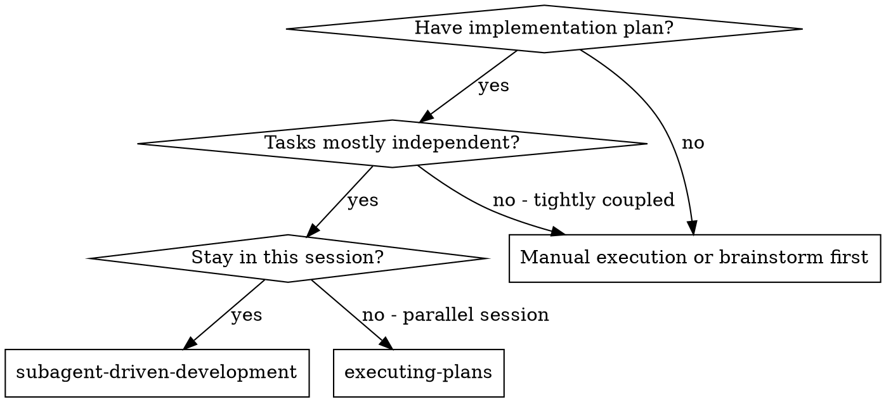
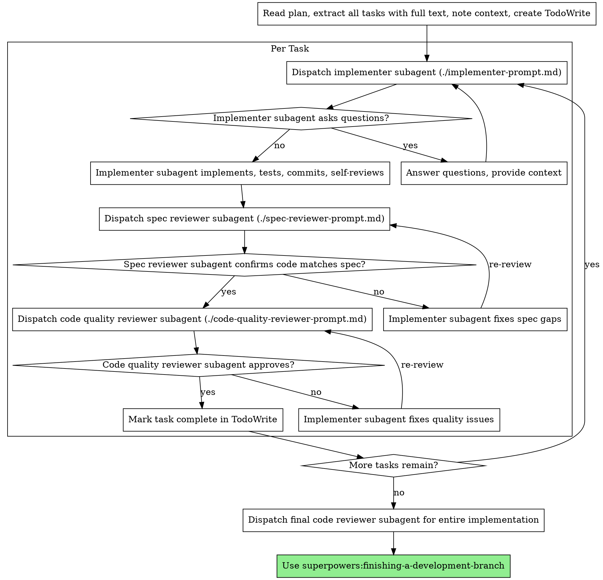

# 子智能体驱动开发

为每个任务分派独立子智能体执行计划，每个任务完成后进行两阶段审查：先审查规格符合性，再审查代码质量。

**核心原则：** 每任务独立子智能体 + 两阶段审查（规格→质量）= 高质量、快迭代

## 何时使用


**对比 executing-plans（并行会话）：**
- 同一会话（无上下文切换）
- 每任务独立子智能体（无上下文污染）
- 每个任务后两阶段审查：先规格符合性，再代码质量
- 更快迭代（任务间无需人工介入）

## 流程



## 提示词模板

- `./implementer-prompt.md` - 分派实现子智能体
- `./spec-reviewer-prompt.md` - 分派规格符合性审查子智能体
- `./code-quality-reviewer-prompt.md` - 分派代码质量审查子智能体

## 示例工作流

```
你：我正在使用子智能体驱动开发来执行这个计划。

[读取计划文件一次：docs/plans/feature-plan.md]
[提取全部5个任务的完整文本和上下文]
[创建包含所有任务的 TodoWrite]

任务1：Hook 安装脚本

[获取任务1文本和上下文（已提取）]
[分派实现子智能体，附带完整任务文本+上下文]

实现者："开始之前——hook 应该安装在用户级别还是系统级别？"

你："用户级别（~/.config/superpowers/hooks/）"

实现者："明白了。现在开始实现..."
[稍后] 实现者：
  - 已实现 install-hook 命令
  - 添加测试，5/5 通过
  - 自审：发现遗漏 --force 标志，已添加
  - 已提交

[分派规格符合性审查者]
规格审查者：✅ 规格符合——所有需求已满足，无多余实现

[获取 git SHA，分派代码质量审查者]
代码审查者：优点：测试覆盖率好，代码整洁。问题：无。通过。

[标记任务1完成]

任务2：恢复模式

[获取任务2文本和上下文（已提取）]
[分派实现子智能体，附带完整任务文本+上下文]

实现者：[无疑问，直接开始]
实现者：
  - 添加了验证/修复模式
  - 8/8 测试通过
  - 自审：一切正常
  - 已提交

[分派规格符合性审查者]
规格审查者：❌ 问题：
  - 缺失：进度报告（规格要求"每100项报告一次"）
  - 多余：添加了 --json 标志（未要求）

[实现者修复问题]
实现者：移除 --json 标志，添加进度报告

[规格审查者再次审查]
规格审查者：✅ 现在符合规格

[分派代码质量审查者]
代码审查者：优点：扎实。问题（重要）：魔法数字（100）

[实现者修复]
实现者：提取 PROGRESS_INTERVAL 常量

[代码审查者再次审查]
代码审查者：✅ 通过

[标记任务2完成]

...

[所有任务完成后]
[分派最终代码审查者]
最终审查者：所有需求已满足，可以合并

完成！
```

## 优势

**对比手动执行：**
- 子智能体天然遵循 TDD
- 每任务独立上下文（无混淆）
- 并行安全（子智能体互不干扰）
- 子智能体可以提问（开始前和工作中均可）

**对比 executing-plans：**
- 同一会话（无交接）
- 进度连续（无等待）
- 审查检查点自动化

**效率提升：**
- 无文件读取开销（控制器提供完整文本）
- 控制器精确筛选所需上下文
- 子智能体预先获得完整信息
- 问题在开始前暴露（而非完成后）

**质量门禁：**
- 自审在交接前发现问题
- 两阶段审查：规格符合性→代码质量
- 审查循环确保修复真正生效
- 规格符合性防止过度/不足实现
- 代码质量确保实现精良

**成本：**
- 更多子智能体调用（每任务：实现者+2审查者）
- 控制器做更多准备工作（预先提取所有任务）
- 审查循环增加迭代
- 但能尽早发现问题（比后期调试成本更低）

## 红线

**绝不：**
- 跳过审查（规格符合性或代码质量）
- 带着未修复的问题继续
- 并行分派多个实现子智能体（会冲突）
- 让子智能体读取计划文件（应提供完整文本）
- 跳过场景设定上下文（子智能体需要理解任务定位）
- 忽视子智能体的问题（先回答再让其继续）
- 在规格符合性上接受"差不多就行"（规格审查者发现问题=未完成）
- 跳过审查循环（审查者发现问题=实现者修复=再次审查）
- 让实现者自审替代实际审查（两者都需要）
- **在规格符合性通过前开始代码质量审查**（顺序错误）
- 在任一审查有未解决问题时进入下一个任务

**如果子智能体提问：**
- 清晰完整地回答
- 必要时提供额外上下文
- 不要催促其开始实现

**如果审查者发现问题：**
- 实现者（同一子智能体）修复
- 审查者再次审查
- 重复直到通过
- 不要跳过复审

**如果子智能体任务失败：**
- 分派修复子智能体并附具体指令
- 不要尝试手动修复（会污染上下文）

## 集成

**必需的工作流技能：**
- **superpowers:writing-plans** - 创建本技能执行的计划
- **superpowers:requesting-code-review** - 审查子智能体的代码审查模板
- **superpowers:finishing-a-development-branch** - 所有任务完成后完成开发

**子智能体应使用：**
- **superpowers:test-driven-development** - 子智能体为每个任务遵循 TDD

**替代工作流：**
- **superpowers:executing-plans** - 用于并行会话而非同一会话执行

## 局限性
- 仅在任务明确匹配上述范围时使用本技能。
- 不要将输出替代环境特定的验证、测试或专家审查。
- 如果缺少必需的输入、权限、安全边界或成功标准，请停下来寻求澄清。
