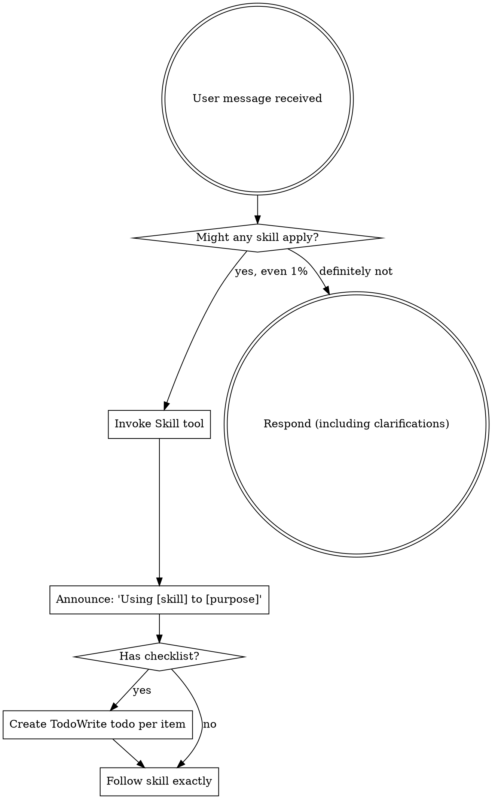

<EXTREMELY-IMPORTANT>
如果你认为某个技能哪怕有 1% 的可能适用于当前任务，你**绝对必须**调用它。

如果某个技能适用于你的任务，你没有选择余地。**必须使用它。**

这没有商量的余地，不是可选项。你不能找任何理由绕过它。
</EXTREMELY-IMPORTANT>

## 如何访问技能

**在 Claude Code 中：** 使用 `Skill` 工具。当你调用一个技能时，其内容会被加载并呈现给你——直接按照它执行。永远不要用 Read 工具读取技能文件。

**在其他环境中：** 查阅你所在平台的文档，了解技能的加载方式。

# 使用技能

## 核心规则

**在任何回复或操作之前，先调用相关或被请求的技能。** 哪怕只有 1% 的可能某个技能适用，你也应该调用它来检查。如果调用后发现该技能不适用于当前场景，你不需要使用它。

## 危险信号

以下想法意味着**停下来**——你在找借口：

| 想法 | 真相 |
|------|------|
| "这只是个简单问题" | 问题也是任务。先检查有没有适用的技能。 |
| "我需要先了解更多上下文" | 技能检查要在澄清性问题**之前**进行。 |
| "让我先探索一下代码库" | 技能会告诉你**如何**探索。先检查。 |
| "我可以快速检查 git/文件" | 文件缺少对话上下文。先检查技能。 |
| "让我先收集信息" | 技能会告诉你**如何**收集信息。 |
| "这不需要正式的技能" | 如果技能存在，就用它。 |
| "我记得这个技能" | 技能会演进。读取当前版本。 |
| "这不算一个任务" | 行动 = 任务。检查技能。 |
| "用技能太小题大做了" | 简单的事会变复杂。用它。 |
| "我先做这一件事" | 做任何事**之前**先检查。 |
| "这感觉很高效" | 没有纪律的行动浪费时间。技能能防止这一点。 |
| "我知道那是什么意思" | 知道概念 ≠ 使用技能。调用它。 |

## 技能优先级

当多个技能可能适用时，按以下顺序：

1. **流程类技能优先**（brainstorming、debugging）——它们决定**如何**处理任务
2. **实现类技能其次**（frontend-design、mcp-builder）——它们指导执行

"我们来构建 X" → 先 brainstorming，再实现类技能。
"修复这个 bug" → 先 debugging，再领域特定技能。

## 技能类型

**刚性**（TDD、debugging）：严格遵循。不要为了适应而丢弃纪律。

**柔性**（patterns）：根据上下文调整原则。

技能本身会告诉你属于哪一类。

## 用户指令

指令说的是**做什么**，而不是**怎么做**。"添加 X" 或 "修复 Y" 不意味着跳过工作流。

## 何时使用
本技能适用于执行概述中描述的工作流或操作。

## 限制
- 仅在任务明确匹配上述范围时使用本技能。
- 不要将输出视为环境特定验证、测试或专家审查的替代品。
- 如果缺少必需的输入、权限、安全边界或成功标准，请停下来寻求澄清。