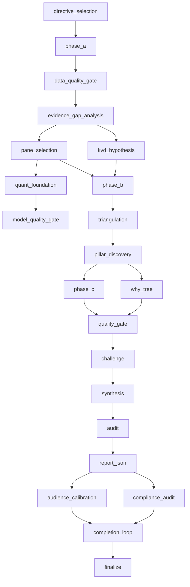

# XVARY 方法论（公开框架）

本文档是 XVARY Research 的**公开框架**。

它有意设计为**菜单，而非菜谱**：阶段名称、逻辑流程与决策哲学对外公开；而内部提示词、阈值与收敛算法则不予公开。

完整叙述：[xvary.com/methodology](https://xvary.com/methodology)

## 研究哲学

XVARY 围绕以下五条原则构建：

1. **差异性认知优先**：价值来自于在共识错误的方向上"方向性地正确"。
2. **证据先于叙事**：事实约束故事，而非故事约束事实。
3. **信念需要赢得**：评分反映的是经过交叉验证的支撑，而非语气或姿态上的"自信表演"。
4. **对抗性挑战是必需的**：每条投资论点发布前都必须被攻击。
5. **失效清单纪律**：每次评级都附带明确的"会让论点失效"的条件。

## 22 阶段运营 DAG（21 阶段研究主干 + 定稿）

> 运营 DAG 在代码中包含 22 个节点（包含 `finalize`）。在公开场合我们将核心研究主干称为 21 阶段方法论，将定稿视为发布控制环节。

### 阶段意图（一句话说明）

1. `directive_selection`：选择行业/风格的证据指令。
2. `phase_a`：收集基线事实、申报文件、市场上下文与广义证据。
3. `data_quality_gate`：拦截完整性不足的事实输入。
4. `evidence_gap_analysis`：检测缺失证据并发起有针对性的检索。
5. `kvd_hypothesis`：识别候选的关键价值驱动因素。
6. `pane_selection`：为公司简介选择报告面板。
7. `quant_foundation`：构建模型脚手架（估值/风险上下文）。
8. `model_quality_gate`：在进入综合分析前对模型输出做合理性检查。
9. `phase_b`：执行丰富化检索与更深入的上下文收集。
10. `triangulation`：在多个独立推理向量之间交叉对比证据。
11. `pillar_discovery`：推导出加权的投资论点支柱。
12. `phase_c`：并行执行模块级综合分析。
13. `why_tree`：拆解因果声明及其依赖链。
14. `quality_gate`：运行结构化的质量测试与一致性检查。
15. `challenge`：对抗性地测试每条支柱与各项假设。
16. `synthesis`：整合信念、差异性观点与情景姿态。
17. `audit`：多角色验证及后续轮次。
18. `report_json`：构建结构化的报告数据载荷。
19. `audience_calibration`：确保可读性 + 决策有用性。
20. `compliance_audit`：验证方法论与政策合规性。
21. `completion_loop`：修补稀疏或不一致的部分。
22. `finalize`：发布闸门与产物的最终化。

## 质量门（公开名称 + 检查内容）

- **Data Quality Gate**：数据缺失、字段陈旧、单位异常、申报文件一致性。
- **Model Quality Gate**：模型输出的合理边界、不可能的结果、假设完整性。
- **Quality Gate**：跨模块一致性、矛盾标记、证据充分性。
- **Audience Calibration**：清晰度、论点可读性、时间压力下的决策速度。
- **Compliance Audit**：方法论遵守情况、来源规范性、输出策略检查。
- **Finalize Gate**：最终验证 + 发布就绪性。

## 23 个研究模块

1. `kvd`：关键价值驱动因素的识别与轨迹刻画。
2. `core_facts`：基线论点框架与差异性设定。
3. `operations`：营收引擎、板块经济学、护城河机制。
4. `financials`：盈利能力、资产负债表质量、现金转化。
5. `valuation`：内在价值区间、情景数学与预期差。
6. `management`：领导力、激励机制与执行可信度。
7. `competition`：市场结构、对手动态、战略压力。
8. `risk`：失效条件、论点破坏点与下行风险图谱。
9. `capital_allocation`：回购/分红/并购的资本配置纪律。
10. `governance`：董事会结构、监督质量与股东利益对齐。
11. `catalysts`：事件地图与时间敏感型论点触发器。
12. `product_tech`：产品护城河、路线图耐久性与创新路径。
13. `supply_chain`：供应商依赖、韧性以及瓶颈暴露。
14. `tam`：市场规模现实性、渗透空间与饱和风险。
15. `street`：市场一致预期 vs. 内部论点。
16. `macro_sensitivity`：利率/汇率/周期的敏感度映射。
17. `value_framework`：投资框架适配 + 决策规则。
18. `quant_profile`：因子、回撤与流动性行为画像。
19. `signals`：另类/领先指标与信号仪表板。
20. `derivs`：期权/空头持仓的定位上下文。
21. `earnings_track`：超预期/不及预期的质量与指引可靠性。
22. `history`：战略时间线与历史类比刻画。
23. `executive_summary`：跨模块综合以便快速决策。

## 信念评分（概念）

信念由加权支柱构成，而非单一模型输出：

- 支柱强度（每条核心声明的支撑程度）
- 支柱依赖风险（每条声明的脆弱性）
- 跨模块一致性（独立模块是否一致？）
- 对抗性挑战存活度（核心声明是否站得住脚？）
- 在已识别失效条件下的下行不对称性

权重会根据商业模式与证据可靠性动态调整。精确的校准属于专有信息。

## 失效清单风险（概念）

每条投资论点都配有一组明确的"会让其失效"的条件。失效清单不是下行风险列表，而是"一旦被破坏就强制重新承销"的最短假设集合。

典型的失效清单类别：

- 结构性需求中断
- 单位经济恶化
- 资产负债表脆弱性
- 监管/制度冲击
- 管理层可信度崩塌

## 五向量三角验证（概念）

在综合分析之前，每只股票都会通过五个独立向量进行评估：

1. **会计现实**
2. **市场隐含预期**
3. **运营执行**
4. **战略定位 / 行业结构**
5. **宏观-制度敏感度**

目标是收敛性测试：向量一致的地方，信念上升；向量分歧的地方，不确定性会被显式呈现。

## 有意不予公开的内容

- 模块提示词模板
- 提示词路由逻辑与回退树
- 阈值矩阵与门控切分点
- 内部收敛评分机制
- 行业特定的指令库
