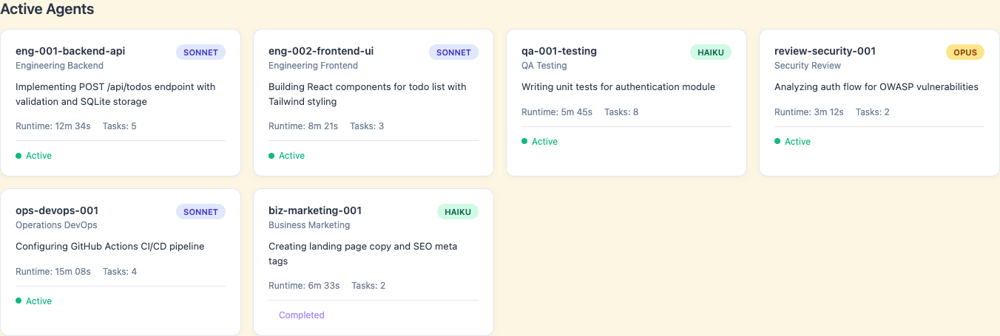
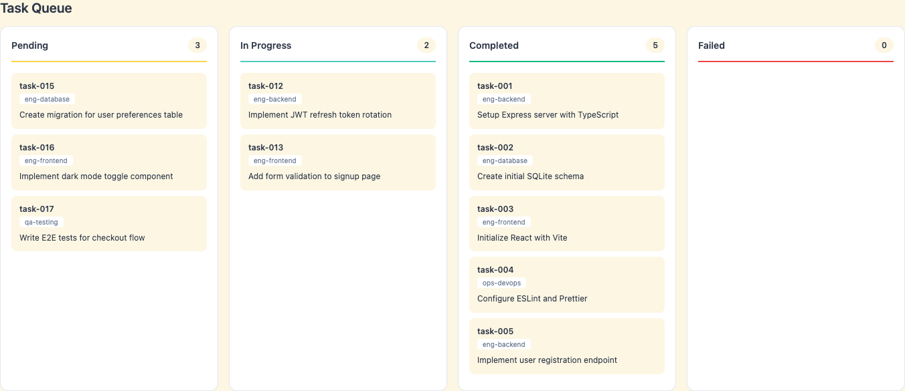

# Loki Mode

**首个真正自主的多智能体创业系统**

[](https://claude.ai)
[]()
[](benchmarks/results/)
[](benchmarks/results/)
[](benchmarks/results/)
[](LICENSE)

> **PRD → 已部署产品，零人工干预**
>
> Loki Mode 在您休息时将产品需求文档转化为完全构建、测试、部署并产生收入的产品。无需手动步骤。无需干预。只有结果。

---

## 演示

[](https://asciinema.org/a/EqNo5IVTaPJfCjLmnYgZ9TC3E)

*点击观看 Loki Mode 从 PRD 构建完整的 Todo 应用 - 零人工干预*

---

## 基准测试结果

### 三方对比（HumanEval）

| 系统 | Pass@1 | 详情 |
|--------|--------|---------|
| **Loki Mode（多智能体）** | **98.78%** | 162/164 问题，RARV 循环恢复了 2 个 |
| 直接 Claude | 98.17% | 161/164 问题（基线） |
| MetaGPT | 85.9-87.7% | 已发布基准 |

**Loki Mode 比 MetaGPT 高出 +11-13%**，得益于 RARV（推理-行动-反思-验证）循环。

### 完整结果

| 基准测试 | 分数 | 详情 |
|-----------|-------|---------|
| **Loki Mode HumanEval** | **98.78% Pass@1** | 162/164（带 RARV 的多智能体） |
| **直接 Claude HumanEval** | **98.17% Pass@1** | 161/164（单智能体基线） |
| **直接 Claude SWE-bench** | **99.67% 补丁生成** | 299/300 问题 |
| **Loki Mode SWE-bench** | **99.67% 补丁生成** | 299/300 问题 |
| 模型 | Claude Opus 4.5 | |

**关键发现：** 超时优化后，多智能体 RARV 在两个基准测试上匹配单智能体性能。4 智能体流水线（架构师->工程师->QA->审查者）实现了与直接 Claude 相同的 99.67% 补丁生成率。

详见 [benchmarks/results/](benchmarks/results/) 获取完整方法论和解决方案。

---

## 什么是 Loki Mode？

Loki Mode 是一个 Claude Code 技能，它编排 **37 种专门的 AI 智能体类型**跨 **6 个群体**自主构建、测试、部署和扩展完整的创业项目。它动态地只生成您需要的智能体——**简单项目 5-10 个，复杂创业项目 100+ 个**——并行工作并持续自我验证。

```
PRD → 研究 → 架构 → 开发 → 测试 → 部署 → 营销 → 收入
```

**只需说"Loki Mode"并指向一个 PRD。走开。回来时产品已部署。**

---

## 为什么选择 Loki Mode？

### **比任何现有方案都好**

| 其他方案做的 | Loki Mode 做的 |
|----------------|---------------------|
| **单智能体**线性写代码 | **100+ 智能体**跨工程、运维、业务、数据、产品和增长并行工作 |
| 需要**手动部署** | **自主部署**到 AWS、GCP、Azure、Vercel、Railway，支持蓝绿和金丝雀策略 |
| **无测试**或基础单元测试 | **14 个自动化质量门**：安全扫描、负载测试、无障碍审计、代码审查 |
| **只有代码** - 您处理其余部分 | **完整业务运营**：营销、销售、法务、HR、财务、投资者关系 |
| 遇到错误**停止** | **自我修复**：熔断器、死信队列、指数退避、自动恢复 |
| 进度**无可见性** | **实时仪表盘**，带智能体监控、任务队列和实时状态更新 |
| 代码写完就"完成" | **永不"完成"**：持续优化、A/B 测试、客户反馈循环、永久改进 |

### **核心优势**

1. **真正自主**：RARV（推理-行动-反思-验证）循环配合自我验证实现 2-3 倍质量提升
2. **大规模并行**：100+ 智能体同时工作，而非顺序单智能体瓶颈
3. **生产就绪**：不只是代码——处理部署、监控、事件响应和业务运营
4. **自我改进**：从错误中学习，更新连续性日志，防止重复错误
5. **零看护**：速率限制时自动恢复，从故障中恢复，运行直到完成
6. **效率优化**：ToolOrchestra 启发的指标追踪每任务成本，奖励信号驱动持续改进

---

## 仪表盘与实时监控

通过 Loki Mode 仪表盘实时监控您的自主创业项目构建：

### **智能体监控**



**实时追踪所有活跃智能体：**
- **智能体 ID** 和**类型**（前端、后端、QA、DevOps 等）
- **模型徽章**（Sonnet、Haiku、Opus）带颜色编码
- 正在执行的**当前工作**
- **运行时间**和**已完成任务数**
- **状态**（活跃、已完成）

### **任务队列可视化**



**四列看板视图：**
- **待处理**：等待智能体的排队任务
- **进行中**：正在处理
- **已完成**：成功完成（显示最近 10 个）
- **失败**：需要关注的任务

### **实时状态监控**

```bash
# 在终端中查看状态更新
watch -n 2 cat .loki/STATUS.txt
```

```
╔════════════════════════════════════════════════════════════════╗
║                    LOKI MODE 状态                            ║
╚════════════════════════════════════════════════════════════════╝

阶段：开发

活跃智能体：47
  ├─ 工程：18
  ├─ 运维：12
  ├─ QA：8
  └─ 业务：9

任务：
  ├─ 待处理：    10
  ├─ 进行中：   47
  ├─ 已完成：  203
  └─ 失败：        0

最后更新：2026-01-04 20:45:32
```

**访问仪表盘：**
```bash
# 自主运行时自动打开
./autonomy/run.sh ./docs/requirements.md

# 或手动打开
open .loki/dashboard/index.html
```

每 3 秒自动刷新。适用于任何现代浏览器。

---

## 自主能力

### **RARV 循环：推理-行动-反思-验证**

Loki Mode 不只是写代码——它**思考、行动、学习和验证**：

```
1. 推理
   └─ 读取 .loki/CONTINUITY.md 包括"错误与学习"
   └─ 检查 .loki/state/ 和 .loki/queue/
   └─ 识别下一个任务或改进

2. 行动
   └─ 执行任务，编写代码
   └─ 原子性提交变更（git 检查点）

3. 反思
   └─ 更新 .loki/CONTINUITY.md 记录进度
   └─ 更新状态文件
   └─ 识别下一个改进

4. 验证
   └─ 运行自动化测试（单元、集成、E2E）
   └─ 检查编译/构建
   └─ 对照规范验证

   如果验证失败：
   ├─ 捕获错误详情（堆栈跟踪、日志）
   ├─ 分析根本原因
   ├─ 更新 CONTINUITY.md 中的"错误与学习"
   ├─ 如需要回滚到最后良好的 git 检查点
   └─ 应用学习并从推理步骤重试
```

**结果：** 通过持续自我验证实现 2-3 倍质量提升。

### **永久改进模式**

**永远没有**"完成"状态。完成 PRD 后，Loki Mode：
- 运行性能优化
- 添加缺失的测试覆盖
- 改进文档
- 重构代码异味
- 更新依赖
- 增强用户体验
- 实施 A/B 测试学习

**它会一直运行直到您停止它。**

### **自动恢复与自我修复**

**速率限制？** 指数退避和自动恢复。
**错误？** 熔断器、死信队列、重试逻辑。
**中断？** 每 5 秒状态检查点——只需重启。

```bash
# 启动自主模式
./autonomy/run.sh ./docs/requirements.md

# 遇到速率限制？脚本自动：
# ├─ 保存状态检查点
# ├─ 指数退避等待（60s → 120s → 240s...）
# ├─ 从精确点恢复
# └─ 继续直到完成或达到最大重试次数（默认：50）
```

---

## 快速开始

### **1. 安装**

```bash
# 克隆到您的 Claude Code 技能目录
git clone https://github.com/asklokesh/loki-mode.git ~/.claude/skills/loki-mode
```

其他安装方法（Web、API 控制台、最小 curl 安装）见 [INSTALLATION.md](INSTALLATION.md)。

### **2. 创建 PRD**

```markdown
# 产品：AI 驱动的 Todo 应用

## 概述
构建一个带 AI 驱动任务建议和截止日期预测的 todo 应用。

## 功能
- 用户认证（邮箱/密码）
- 创建、读取、更新、删除 todos
- AI 基于模式建议下一个任务
- 智能截止日期预测
- 移动端响应式设计

## 技术栈
- Next.js 14 + TypeScript
- PostgreSQL 数据库
- OpenAI API 用于建议
- 部署到 Vercel
```

保存为 `my-prd.md`。

### **3. 运行 Loki Mode**

```bash
# 自主模式（推荐）
./autonomy/run.sh ./my-prd.md

# 或手动模式
claude --dangerously-skip-permissions
> Loki Mode with PRD at ./my-prd.md
```

### **4. 监控进度**

在浏览器中打开仪表盘（自动打开）或检查状态：

```bash
watch -n 2 cat .loki/STATUS.txt
```

### **5. 走开**

真的。去喝杯咖啡。回来时已部署完成。

**就这样。** 无需配置。无需手动步骤。无需干预。

---

## 智能体群体（37 种类型）

Loki Mode 有 **37 种预定义智能体类型**，组织成 **6 个专门群体**。编排器只生成您需要的——简单项目使用 5-10 个智能体，复杂创业项目生成 100+ 个。


### **工程（8 种类型）**
`eng-frontend` `eng-backend` `eng-database` `eng-mobile` `eng-api` `eng-qa` `eng-perf` `eng-infra`

### **运维（8 种类型）**
`ops-devops` `ops-sre` `ops-security` `ops-monitor` `ops-incident` `ops-release` `ops-cost` `ops-compliance`

### **业务（8 种类型）**
`biz-marketing` `biz-sales` `biz-finance` `biz-legal` `biz-support` `biz-hr` `biz-investor` `biz-partnerships`

### **数据（3 种类型）**
`data-ml` `data-eng` `data-analytics`

### **产品（3 种类型）**
`prod-pm` `prod-design` `prod-techwriter`

### **增长（4 种类型）**
`growth-hacker` `growth-community` `growth-success` `growth-lifecycle`

### **审查（3 种类型）**
`review-code` `review-business` `review-security`

完整智能体类型定义见 [references/agents.md](references/agents.md)。

---

## 工作原理

### **阶段执行**

| 阶段 | 描述 |
|-------|-------------|
| **0. 引导** | 创建 `.loki/` 目录结构，初始化状态 |
| **1. 发现** | 解析 PRD，通过网页搜索进行竞争研究 |
| **2. 架构** | 技术栈选择与自我反思 |
| **3. 基础设施** | 配置云、CI/CD、监控 |
| **4. 开发** | TDD 实现，并行代码审查 |
| **5. QA** | 14 个质量门，安全审计，负载测试 |
| **6. 部署** | 蓝绿部署，出错自动回滚 |
| **7. 业务** | 营销、销售、法务、支持设置 |
| **8. 增长** | 持续优化，A/B 测试，反馈循环 |

### **并行代码审查**

每个代码变更同时经过 **3 个专门审查者**：

```
实现 → 审查（并行） → 汇总 → 修复 → 重新审查 → 完成
                │
                ├─ code-reviewer（Opus）- 代码质量、模式、最佳实践
                ├─ business-logic-reviewer（Opus）- 需求、边界情况、UX
                └─ security-reviewer（Opus）- 漏洞、OWASP Top 10
```

**基于严重性的问题处理：**
- **严重/高/中**：阻断。立即修复。重新审查。
- **低**：添加 `// TODO(review): ...` 注释，继续。
- **外观**：添加 `// FIXME(nitpick): ...` 注释，继续。

### **目录结构**

```
.loki/
├── state/          # 编排器和智能体状态
├── queue/          # 任务队列（待处理、进行中、已完成、死信）
├── memory/         # 情景、语义和程序记忆
├── metrics/        # 效率追踪和奖励信号
├── messages/       # 智能体间通信
├── logs/           # 审计日志
├── config/         # 配置文件
├── prompts/        # 智能体角色提示
├── artifacts/      # 发布、报告、备份
├── dashboard/      # 实时监控仪表盘
└── scripts/        # 辅助脚本
```

---

## 示例 PRD

使用 `examples/` 目录中的预构建 PRD 测试 Loki Mode：

| PRD | 复杂度 | 预计时间 | 描述 |
|-----|------------|-----------|-------------|
| `simple-todo-app.md` | 低 | ~10 分钟 | 基础 todo 应用 - 测试核心功能 |
| `api-only.md` | 低 | ~10 分钟 | 仅 REST API - 测试后端智能体 |
| `static-landing-page.md` | 低 | ~5 分钟 | 仅 HTML/CSS - 测试前端/营销 |
| `full-stack-demo.md` | 中 | ~30-60 分钟 | 完整书签管理器 - 全面测试 |

```bash
# 示例：使用简单 todo 应用运行
./autonomy/run.sh examples/simple-todo-app.md
```

---

## 配置

### **自主设置**

通过环境变量自定义自主运行器：

```bash
LOKI_MAX_RETRIES=100 \
LOKI_BASE_WAIT=120 \
LOKI_MAX_WAIT=7200 \
./autonomy/run.sh ./docs/requirements.md
```

| 变量 | 默认值 | 描述 |
|----------|---------|-------------|
| `LOKI_MAX_RETRIES` | 50 | 放弃前的最大重试次数 |
| `LOKI_BASE_WAIT` | 60 | 基础等待时间（秒） |
| `LOKI_MAX_WAIT` | 3600 | 最大等待时间（1 小时） |
| `LOKI_SKIP_PREREQS` | false | 跳过前置条件检查 |

### **熔断器**

```yaml
# .loki/config/circuit-breakers.yaml
defaults:
  failureThreshold: 5
  cooldownSeconds: 300
```

### **外部告警**

```yaml
# .loki/config/alerting.yaml
channels:
  slack:
    webhook_url: "${SLACK_WEBHOOK_URL}"
    severity: [critical, high]
  pagerduty:
    integration_key: "${PAGERDUTY_KEY}"
    severity: [critical]
```

---

## 系统要求

- **Claude Code** 带 `--dangerously-skip-permissions` 标志
- **互联网访问**用于竞争研究和部署
- **云服务商凭证**（用于部署阶段）
- **Python 3**（用于测试套件）

**可选但推荐：**
- Git（用于版本控制和检查点）
- Node.js/npm（用于仪表盘和 Web 项目）
- Docker（用于容器化部署）

---

## 集成

### **Vibe Kanban（可视化仪表盘）**

与 [Vibe Kanban](https://github.com/BloopAI/vibe-kanban) 集成获取可视化看板：

```bash
# 安装 Vibe Kanban
npx vibe-kanban

# 导出 Loki 任务到 Vibe Kanban
./scripts/export-to-vibe-kanban.sh
```

**好处：**
- 所有活跃智能体的可视化进度追踪
- 需要时手动干预/优先级调整
- 带可视化差异的代码审查
- 多项目仪表盘

完整设置指南见 [integrations/vibe-kanban.md](integrations/vibe-kanban.md)。

---

## 测试

运行综合测试套件：

```bash
# 运行所有测试
./tests/run-all-tests.sh

# 或运行单独的测试套件
./tests/test-bootstrap.sh        # 目录结构、状态初始化
./tests/test-task-queue.sh       # 队列操作、优先级
./tests/test-circuit-breaker.sh  # 故障处理、恢复
./tests/test-agent-timeout.sh    # 超时、卡住进程处理
./tests/test-state-recovery.sh   # 检查点、恢复
```

---

## 贡献

欢迎贡献！请：
1. 阅读 [SKILL.md](SKILL.md) 了解架构
2. 查看 [references/agents.md](references/agents.md) 了解智能体定义
3. 为 bug 或功能请求提交 issue
4. 提交带清晰描述和测试的 PR

---

## 许可证

MIT 许可证 - 详见 [LICENSE](LICENSE)。

---

## 致谢

Loki Mode 整合了来自领先 AI 实验室和实践者的研究和模式：

### 研究基础

| 来源 | 关键贡献 |
|--------|------------------|
| [Anthropic: Building Effective Agents](https://www.anthropic.com/research/building-effective-agents) | 评估器-优化器模式、并行化 |
| [Anthropic: Constitutional AI](https://www.anthropic.com/research/constitutional-ai-harmlessness-from-ai-feedback) | 对照原则进行自我批评 |
| [DeepMind: Scalable Oversight via Debate](https://deepmind.google/research/publications/34920/) | 基于辩论的验证 |
| [DeepMind: SIMA 2](https://deepmind.google/blog/sima-2-an-agent-that-plays-reasons-and-learns-with-you-in-virtual-3d-worlds/) | 自我改进循环 |
| [OpenAI: Agents SDK](https://openai.github.io/openai-agents-python/) | 护栏、触发线、追踪 |
| [NVIDIA ToolOrchestra](https://github.com/NVlabs/ToolOrchestra) | 效率指标、奖励信号 |
| [CONSENSAGENT (ACL 2025)](https://aclanthology.org/2025.findings-acl.1141/) | 反迎合、盲审 |
| [GoalAct](https://arxiv.org/abs/2504.16563) | 分层规划 |

### 实践者洞察

- **Boris Cherny**（Claude Code 创造者）- 自我验证循环、扩展思考
- **Simon Willison** - 用于上下文隔离的子智能体、技能系统
- **Hacker News 社区** - 来自真实部署的[生产模式](https://news.ycombinator.com/item?id=44623207)

### 灵感来源

- [LerianStudio/ring](https://github.com/LerianStudio/ring) - 子智能体驱动开发模式
- [Awesome Agentic Patterns](https://github.com/nibzard/awesome-agentic-patterns) - 105+ 生产模式

**[完整致谢](ACKNOWLEDGEMENTS.md)** - 50+ 研究论文、文章和资源的完整列表

为 [Claude Code](https://claude.ai) 生态系统构建，由 Anthropic 的 Claude 模型（Sonnet、Haiku、Opus）驱动。

---

**准备好在您休息时构建创业项目了吗？**

```bash
git clone https://github.com/asklokesh/loki-mode.git ~/.claude/skills/loki-mode
./autonomy/run.sh your-prd.md
```

---

**关键词：** claude-code, claude-skills, ai-agents, autonomous-development, multi-agent-system, sdlc-automation, startup-automation, devops, mlops, deployment-automation, self-healing, perpetual-improvement
