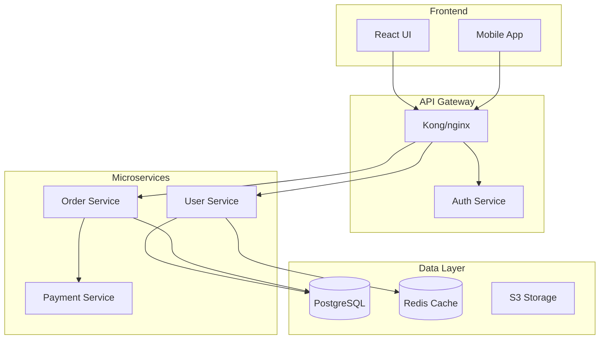

# 自动化文档生成实施手册

本文件包含该技能所引用的详细模式、检查清单和代码示例。

## 指令

通过分析代码库并创建以下产物，生成全面的文档：

### 1. **API 文档**
- 从代码中提取端点定义、参数和响应
- 生成 OpenAPI/Swagger 规范
- 创建交互式 API 文档（Swagger UI、Redoc）
- 包含认证、速率限制和错误处理细节

### 2. **架构文档**
- 创建系统架构图（Mermaid、PlantUML）
- 记录组件关系和数据流
- 解释服务依赖和通信模式
- 包含可扩展性和可靠性考量

### 3. **代码文档**
- 生成内联文档和 docstring
- 创建包含安装、使用和贡献指南的 README 文件
- 记录配置选项和环境变量
- 提供故障排查指南和代码示例

### 4. **用户文档**
- 编写分步用户指南
- 创建入门教程
- 记录常见工作流和用例
- 包含无障碍和本地化说明

### 5. **文档自动化**
- 为自动文档生成配置 CI/CD 流水线
- 设置文档 lint 和验证
- 实施文档覆盖率检查
- 自动化部署到托管平台

### 质量标准

确保所有生成的文档：

- 准确且与当前代码同步
- 使用一致的术语和格式
- 包含实际示例和用例
- 可搜索且组织良好
- 遵循无障碍最佳实践

## 参考示例

### 示例 1：用于文档的代码分析

**API 文档提取**
```python
import ast
from typing import Dict, List

class APIDocExtractor:
    def extract_endpoints(self, code_path):
        """Extract API endpoints and their documentation"""
        endpoints = []

        with open(code_path, 'r') as f:
            tree = ast.parse(f.read())

        for node in ast.walk(tree):
            if isinstance(node, ast.FunctionDef):
                for decorator in node.decorator_list:
                    if self._is_route_decorator(decorator):
                        endpoint = {
                            'method': self._extract_method(decorator),
                            'path': self._extract_path(decorator),
                            'function': node.name,
                            'docstring': ast.get_docstring(node),
                            'parameters': self._extract_parameters(node),
                            'returns': self._extract_returns(node)
                        }
                        endpoints.append(endpoint)
        return endpoints

    def _extract_parameters(self, func_node):
        """Extract function parameters with types"""
        params = []
        for arg in func_node.args.args:
            param = {
                'name': arg.arg,
                'type': ast.unparse(arg.annotation) if arg.annotation else None,
                'required': True
            }
            params.append(param)
        return params
```

**Schema 提取**
```python
def extract_pydantic_schemas(file_path):
    """Extract Pydantic model definitions for API documentation"""
    schemas = []

    with open(file_path, 'r') as f:
        tree = ast.parse(f.read())

    for node in ast.walk(tree):
        if isinstance(node, ast.ClassDef):
            if any(base.id == 'BaseModel' for base in node.bases if hasattr(base, 'id')):
                schema = {
                    'name': node.name,
                    'description': ast.get_docstring(node),
                    'fields': []
                }

                for item in node.body:
                    if isinstance(item, ast.AnnAssign):
                        field = {
                            'name': item.target.id,
                            'type': ast.unparse(item.annotation),
                            'required': item.value is None
                        }
                        schema['fields'].append(field)
                schemas.append(schema)
    return schemas
```

### 示例 2：OpenAPI 规范生成

**OpenAPI 模板**
```yaml
openapi: 3.0.0
info:
  title: ${API_TITLE}
  version: ${VERSION}
  description: |
    ${DESCRIPTION}

    ## Authentication
    ${AUTH_DESCRIPTION}

servers:
  - url: https://api.example.com/v1
    description: Production server

security:
  - bearerAuth: []

paths:
  /users:
    get:
      summary: List all users
      operationId: listUsers
      tags:
        - Users
      parameters:
        - name: page
          in: query
          schema:
            type: integer
            default: 1
        - name: limit
          in: query
          schema:
            type: integer
            default: 20
            maximum: 100
      responses:
        '200':
          description: Successful response
          content:
            application/json:
              schema:
                type: object
                properties:
                  data:
                    type: array
                    items:
                      $ref: '#/components/schemas/User'
                  pagination:
                    $ref: '#/components/schemas/Pagination'
        '401':
          $ref: '#/components/responses/Unauthorized'

components:
  schemas:
    User:
      type: object
      required:
        - id
        - email
      properties:
        id:
          type: string
          format: uuid
        email:
          type: string
          format: email
        name:
          type: string
        createdAt:
          type: string
          format: date-time
```

### 示例 3：架构图

**系统架构（Mermaid）**


**组件文档**
```markdown
## User Service

**Purpose**: Manages user accounts, authentication, and profiles

**Technology Stack**:
- Language: Python 3.11
- Framework: FastAPI
- Database: PostgreSQL
- Cache: Redis
- Authentication: JWT

**API Endpoints**:
- `POST /users` - Create new user
- `GET /users/{id}` - Get user details
- `PUT /users/{id}` - Update user
- `POST /auth/login` - User login

**Configuration**:
```yaml
user_service:
  port: 8001
  database:
    host: postgres.internal
    name: users_db
  jwt:
    secret: ${JWT_SECRET}
    expiry: 3600
```
```

### 示例 4：README 生成

**README 模板**
```markdown
# ${PROJECT_NAME}

${BADGES}

${SHORT_DESCRIPTION}

## Features

${FEATURES_LIST}

## Installation

### Prerequisites

- Python 3.8+
- PostgreSQL 12+
- Redis 6+

### Using pip

```bash
pip install ${PACKAGE_NAME}
```

### From source

```bash
git clone https://github.com/${GITHUB_ORG}/${REPO_NAME}.git
cd ${REPO_NAME}
pip install -e .
```

## Quick Start

```python
${QUICK_START_CODE}
```

## Configuration

### Environment Variables

| Variable | Description | Default | Required |
|----------|-------------|---------|----------|
| DATABASE_URL | PostgreSQL connection string | - | Yes |
| REDIS_URL | Redis connection string | - | Yes |
| SECRET_KEY | Application secret key | - | Yes |

## Development

```bash
# Clone and setup
git clone https://github.com/${GITHUB_ORG}/${REPO_NAME}.git
cd ${REPO_NAME}
python -m venv venv
source venv/bin/activate

# Install dependencies
pip install -r requirements-dev.txt

# Run tests
pytest

# Start development server
python manage.py runserver
```

## Testing

```bash
# Run all tests
pytest

# Run with coverage
pytest --cov=your_package
```

## Contributing

1. Fork the repository
2. Create a feature branch (`git checkout -b feature/amazing-feature`)
3. Commit your changes (`git commit -m 'Add amazing feature'`)
4. Push to the branch (`git push origin feature/amazing-feature`)
5. Open a Pull Request

## License

This project is licensed under the ${LICENSE} License - see the LICENSE file for details.
```

### 示例 5：函数文档生成器

```python
import inspect

def generate_function_docs(func):
    """Generate comprehensive documentation for a function"""
    sig = inspect.signature(func)
    params = []
    args_doc = []

    for param_name, param in sig.parameters.items():
        param_str = param_name
        if param.annotation != param.empty:
            param_str += f": {param.annotation.__name__}"
        if param.default != param.empty:
            param_str += f" = {param.default}"
        params.append(param_str)
        args_doc.append(f"{param_name}: Description of {param_name}")

    return_type = ""
    if sig.return_annotation != sig.empty:
        return_type = f" -> {sig.return_annotation.__name__}"

    doc_template = f'''
def {func.__name__}({", ".join(params)}){return_type}:
    """
    Brief description of {func.__name__}

    Args:
        {chr(10).join(f"        {arg}" for arg in args_doc)}

    Returns:
        Description of return value

    Examples:
        >>> {func.__name__}(example_input)
        expected_output
    """
'''
    return doc_template
```

### 示例 6：用户指南模板

```markdown
# User Guide

## Getting Started

### Creating Your First ${FEATURE}

1. **Navigate to the Dashboard**

   Click on the ${FEATURE} tab in the main navigation menu.

2. **Click "Create New"**

   You'll find the "Create New" button in the top right corner.

3. **Fill in the Details**

   - **Name**: Enter a descriptive name
   - **Description**: Add optional details
   - **Settings**: Configure as needed

4. **Save Your Changes**

   Click "Save" to create your ${FEATURE}.

### Common Tasks

#### Editing ${FEATURE}

1. Find your ${FEATURE} in the list
2. Click the "Edit" button
3. Make your changes
4. Click "Save"

#### Deleting ${FEATURE}

> ⚠️ **Warning**: Deletion is permanent and cannot be undone.

1. Find your ${FEATURE} in the list
2. Click the "Delete" button
3. Confirm the deletion

### Troubleshooting

| Error | Meaning | Solution |
|-------|---------|----------|
| "Name required" | The name field is empty | Enter a name |
| "Permission denied" | You don't have access | Contact admin |
| "Server error" | Technical issue | Try again later |
```

### 示例 7：交互式 API 演练场

**Swagger UI 设置**
```html
<!DOCTYPE html>
<html>
<head>
    <title>API Documentation</title>
    <link rel="stylesheet" href="https://cdn.jsdelivr.net/npm/swagger-ui-dist@latest/swagger-ui.css">
</head>
<body>
    <div id="swagger-ui"></div>

    <script src="https://cdn.jsdelivr.net/npm/swagger-ui-dist@latest/swagger-ui-bundle.js"></script>
    <script>
        window.onload = function() {
            SwaggerUIBundle({
                url: "/api/openapi.json",
                dom_id: '#swagger-ui',
                deepLinking: true,
                presets: [SwaggerUIBundle.presets.apis],
                layout: "StandaloneLayout"
            });
        }
    </script>
</body>
</html>
```

**代码示例生成器**
```python
def generate_code_examples(endpoint):
    """Generate code examples for API endpoints in multiple languages"""
    examples = {}

    # Python
    examples['python'] = f'''
import requests

url = "https://api.example.com{endpoint['path']}"
headers = {{"Authorization": "Bearer YOUR_API_KEY"}}

response = requests.{endpoint['method'].lower()}(url, headers=headers)
print(response.json())
'''

    # JavaScript
    examples['javascript'] = f'''
const response = await fetch('https://api.example.com{endpoint['path']}', {{
    method: '{endpoint['method']}',
    headers: {{'Authorization': 'Bearer YOUR_API_KEY'}}
}});

const data = await response.json();
console.log(data);
'''

    # cURL
    examples['curl'] = f'''
curl -X {endpoint['method']} https://api.example.com{endpoint['path']} \\
    -H "Authorization: Bearer YOUR_API_KEY"
'''

    return examples
```

### 示例 8：文档 CI/CD

**GitHub Actions 工作流**
```yaml
name: Generate Documentation

on:
  push:
    branches: [main]
    paths:
      - 'src/**'
      - 'api/**'

jobs:
  generate-docs:
    runs-on: ubuntu-latest

    steps:
    - uses: actions/checkout@v3

    - name: Set up Python
      uses: actions/setup-python@v4
      with:
        python-version: '3.11'

    - name: Install dependencies
      run: |
        pip install -r requirements-docs.txt
        npm install -g @redocly/cli

    - name: Generate API documentation
      run: |
        python scripts/generate_openapi.py > docs/api/openapi.json
        redocly build-docs docs/api/openapi.json -o docs/api/index.html

    - name: Generate code documentation
      run: sphinx-build -b html docs/source docs/build

    - name: Deploy to GitHub Pages
      uses: peaceiris/actions-gh-pages@v3
      with:
        github_token: ${{ secrets.GITHUB_TOKEN }}
        publish_dir: ./docs/build
```

### 示例 9：文档覆盖率验证

```python
import ast
import glob

class DocCoverage:
    def check_coverage(self, codebase_path):
        """Check documentation coverage for codebase"""
        results = {
            'total_functions': 0,
            'documented_functions': 0,
            'total_classes': 0,
            'documented_classes': 0,
            'missing_docs': []
        }

        for file_path in glob.glob(f"{codebase_path}/**/*.py", recursive=True):
            module = ast.parse(open(file_path).read())

            for node in ast.walk(module):
                if isinstance(node, ast.FunctionDef):
                    results['total_functions'] += 1
                    if ast.get_docstring(node):
                        results['documented_functions'] += 1
                    else:
                        results['missing_docs'].append({
                            'type': 'function',
                            'name': node.name,
                            'file': file_path,
                            'line': node.lineno
                        })

                elif isinstance(node, ast.ClassDef):
                    results['total_classes'] += 1
                    if ast.get_docstring(node):
                        results['documented_classes'] += 1
                    else:
                        results['missing_docs'].append({
                            'type': 'class',
                            'name': node.name,
                            'file': file_path,
                            'line': node.lineno
                        })

        # Calculate coverage percentages
        results['function_coverage'] = (
            results['documented_functions'] / results['total_functions'] * 100
            if results['total_functions'] > 0 else 100
        )
        results['class_coverage'] = (
            results['documented_classes'] / results['total_classes'] * 100
            if results['total_classes'] > 0 else 100
        )

        return results
```

## 输出格式

1. **API 文档**：带交互式演练场的 OpenAPI 规范
2. **架构图**：系统、序列和组件图
3. **代码文档**：内联文档、docstring 和类型提示
4. **用户指南**：分步教程
5. **开发指南**：安装、贡献和 API 使用指南
6. **参考文档**：包含示例的完整 API 参考
7. **文档站点**：部署的带搜索功能的静态站点

专注于创建准确、全面且易于随代码变更维护的文档。
