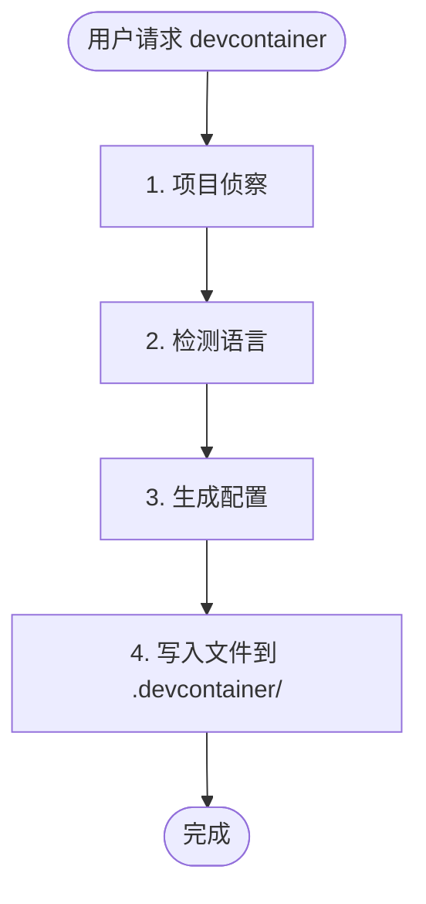

# Devcontainer Setup 技能

创建预配置的开发容器，包含 Claude Code 和语言特定工具。

## 适用场景

- 用户要求"设置 devcontainer"或"添加 devcontainer 支持"
- 用户需要沙盒化的 Claude Code 开发环境
- 用户需要带持久化配置的隔离开发环境

## 不适用场景

- 用户已有 devcontainer 配置，仅需修改
- 用户询问通用 Docker 或容器问题
- 用户想部署生产容器（本技能仅用于开发环境）

## 工作流程



## 阶段 1：项目侦察

### 推断项目名称

按顺序检查（使用首个匹配项）：

1. `package.json` → `name` 字段
2. `pyproject.toml` → `project.name`
3. `Cargo.toml` → `package.name`
4. `go.mod` → 模块路径（`/` 后的最后一段）
5. 目录名作为后备方案

转换为 slug：小写，将空格/下划线替换为连字符。

### 检测语言栈

| 语言 | 检测文件 |
|------|----------|
| Python | `pyproject.toml`, `*.py` |
| Node/TypeScript | `package.json`, `tsconfig.json` |
| Rust | `Cargo.toml` |
| Go | `go.mod`, `go.sum` |

### 多语言项目

如果检测到多种语言，按以下优先级顺序配置所有语言：

1. **Python** - 主语言，使用 Dockerfile 安装 uv + Python
2. **Node/TypeScript** - 使用 devcontainer feature
3. **Rust** - 使用 devcontainer feature
4. **Go** - 使用 devcontainer feature

对于多语言的 `postCreateCommand`，链接所有设置命令：
```
uv run /opt/post_install.py && uv sync && npm ci
```

所有检测到语言的扩展和设置应合并到配置中。

## 阶段 2：生成配置

从 `resources/` 目录的基础模板开始。替换：

- `{{PROJECT_NAME}}` → 人类可读名称（如 "My Project"）
- `{{PROJECT_SLUG}}` → 用于卷的 slug（如 "my-project"）

然后应用下方的语言特定修改。

## 基础模板特性

基础模板包含：

- **Claude Code** 及市场插件（anthropics/skills, trailofbits/skills, trailofbits/skills-curated）
- **Python 3.13** 通过 uv（快速二进制下载）
- **Node 22** 通过 fnm（Fast Node Manager）
- **ast-grep** 用于基于 AST 的代码搜索
- **网络隔离工具**（iptables, ipset）带 NET_ADMIN 能力
- **现代 CLI 工具**：ripgrep, fd, fzf, tmux, git-delta

---

## 语言特定章节

### Python 项目

**检测：** `pyproject.toml`, `requirements.txt`, `setup.py` 或 `*.py` 文件

**Dockerfile 添加内容：**

基础 Dockerfile 已通过 uv 包含 Python 3.13。如果需要不同版本（从 `pyproject.toml` 检测），修改 Python 安装：

```dockerfile
# Install Python via uv (fast binary download, not source compilation)
RUN uv python install <version> --default
```

**devcontainer.json 扩展：**

添加到 `customizations.vscode.extensions`：
```json
"ms-python.python",
"ms-python.vscode-pylance",
"charliermarsh.ruff"
```

添加到 `customizations.vscode.settings`：
```json
"python.defaultInterpreterPath": ".venv/bin/python",
"[python]": {
  "editor.defaultFormatter": "charliermarsh.ruff",
  "editor.codeActionsOnSave": {
    "source.organizeImports": "explicit"
  }
}
```

**postCreateCommand：**
如果存在 `pyproject.toml`，链接命令：
```
rm -rf .venv && uv sync && uv run /opt/post_install.py
```

---

### Node/TypeScript 项目

**检测：** `package.json` 或 `tsconfig.json`

**无需 Dockerfile 添加：** 基础模板已通过 fnm（Fast Node Manager）包含 Node 22。

**devcontainer.json 扩展：**

添加到 `customizations.vscode.extensions`：
```json
"dbaeumer.vscode-eslint",
"esbenp.prettier-vscode"
```

添加到 `customizations.vscode.settings`：
```json
"editor.defaultFormatter": "esbenp.prettier-vscode",
"editor.codeActionsOnSave": {
  "source.fixAll.eslint": "explicit"
}
```

**postCreateCommand：**
从锁文件检测包管理器并与基础命令链接：
- `pnpm-lock.yaml` → `uv run /opt/post_install.py && pnpm install --frozen-lockfile`
- `yarn.lock` → `uv run /opt/post_install.py && yarn install --frozen-lockfile`
- `package-lock.json` → `uv run /opt/post_install.py && npm ci`
- 无锁文件 → `uv run /opt/post_install.py && npm install`

---

### Rust 项目

**检测：** `Cargo.toml`

**要添加的 features：**

```json
"ghcr.io/devcontainers/features/rust:1": {}
```

**devcontainer.json 扩展：**

添加到 `customizations.vscode.extensions`：
```json
"rust-lang.rust-analyzer",
"tamasfe.even-better-toml"
```

添加到 `customizations.vscode.settings`：
```json
"[rust]": {
  "editor.defaultFormatter": "rust-lang.rust-analyzer"
}
```

**postCreateCommand：**
如果存在 `Cargo.lock`，使用锁定构建：
```
uv run /opt/post_install.py && cargo build --locked
```
如果无锁文件，使用标准构建：
```
uv run /opt/post_install.py && cargo build
```

---

### Go 项目

**检测：** `go.mod`

**要添加的 features：**

```json
"ghcr.io/devcontainers/features/go:1": {
  "version": "latest"
}
```

**devcontainer.json 扩展：**

添加到 `customizations.vscode.extensions`：
```json
"golang.go"
```

添加到 `customizations.vscode.settings`：
```json
"[go]": {
  "editor.defaultFormatter": "golang.go"
},
"go.useLanguageServer": true
```

**postCreateCommand：**
```
uv run /opt/post_install.py && go mod download
```

---

## 参考资料

如需更多指导，请参阅：
- `references/dockerfile-best-practices.md` - 层优化、多阶段构建、架构支持
- `references/features-vs-dockerfile.md` - 何时使用 devcontainer features vs 自定义 Dockerfile

---

## 添加持久化卷

在 `devcontainer.json` 中添加新挂载的模式：

```json
"mounts": [
  "source={{PROJECT_SLUG}}-<purpose>-${devcontainerId},target=<container-path>,type=volume"
]
```

常见添加项：
- `source={{PROJECT_SLUG}}-cargo-${devcontainerId},target=/home/vscode/.cargo,type=volume` (Rust)
- `source={{PROJECT_SLUG}}-go-${devcontainerId},target=/home/vscode/go,type=volume` (Go)

---

## 输出文件

在项目的 `.devcontainer/` 目录中生成以下文件：

1. `Dockerfile` - 容器构建指令
2. `devcontainer.json` - VS Code/devcontainer 配置
3. `post_install.py` - 创建后设置脚本
4. `.zshrc` - Shell 配置
5. `install.sh` - 管理 devcontainer 的 CLI 辅助脚本（`devc` 命令）

---

## 验证清单

在向用户展示文件前，验证：

1. 所有 `{{PROJECT_NAME}}` 占位符已替换为人类可读名称
2. 所有 `{{PROJECT_SLUG}}` 占位符已替换为 slug 化名称
3. `devcontainer.json` 中 JSON 语法有效（无尾随逗号，嵌套正确）
4. 所有检测到的语言已添加对应扩展
5. `postCreateCommand` 包含所有必需的设置命令（用 `&&` 链接）

---

## 用户说明

生成后，告知用户：

1. 如何启动："在 VS Code 中打开并选择 'Reopen in Container'"
2. 替代方式：`devcontainer up --workspace-folder .`
3. CLI 辅助：运行 `.devcontainer/install.sh self-install` 将 `devc` 命令添加到 PATH

## 限制
- 仅在任务明确符合上述范围时使用本技能。
- 输出不能替代特定环境的验证、测试或专家审查。
- 如果缺少必需的输入、权限、安全边界或成功标准，请停止并请求澄清。
