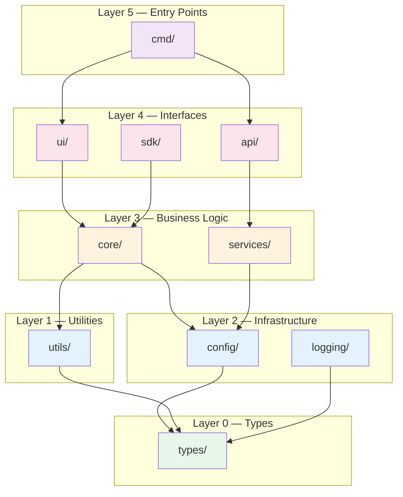
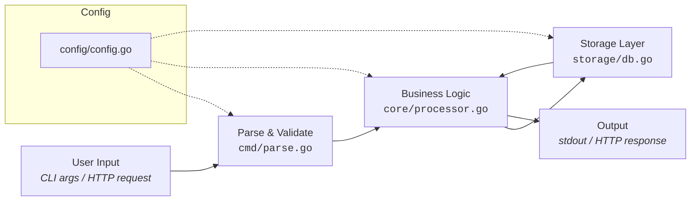
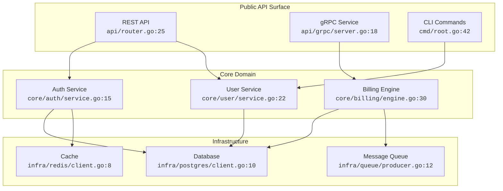
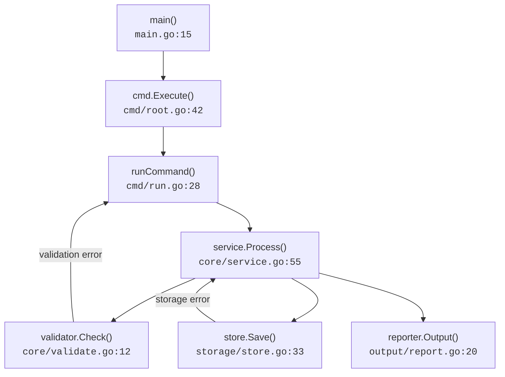
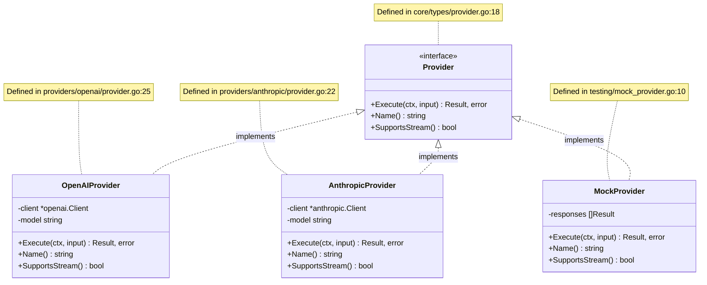
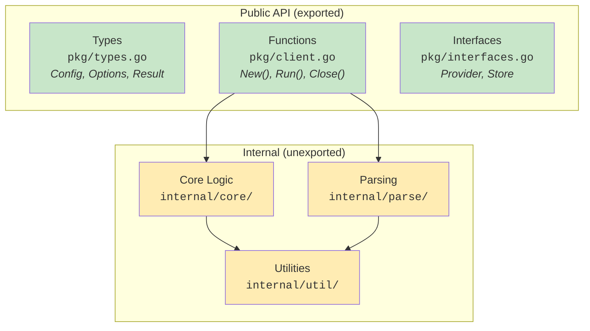
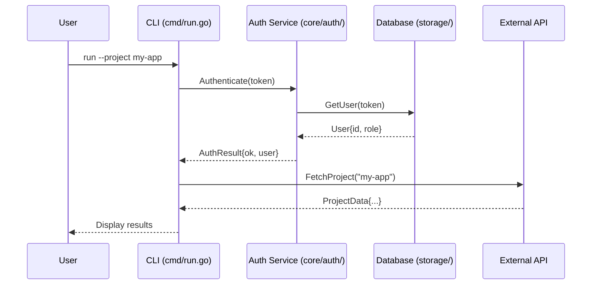

# 架构图模板

用于可视化代码库结构的自动生成 Mermaid 图。这些图源自
实际代码分析 —— 不是手工绘制的，不是理想化的。每个图都应反映
代码**实际**做什么，而不是作者希望它做什么。

## 目录

- [如何生成图](#如何生成图)
- [包依赖图](#1-包依赖图)
- [数据流图](#2-数据流图)
- [组件关系图](#3-组件关系图)
- [调用层次图](#4-调用层次图)
- [接口实现图](#5-接口实现图)
- [模块边界图](#6-模块边界图)
- [关键流程时序图](#7-关键流程时序图)

---

## 如何生成图

通过分析实际代码生成图，而不是猜测。遵循此过程：

### Go 项目
```bash
# 列出所有包及其导入
go list -json ./... | jq '{ImportPath, Imports}'

# 查找接口及其实现
grep -rn 'type.*interface' --include='*.go' .
grep -rn 'func.*) .*(' --include='*.go' . | head -50

# 映射包依赖
go list -m -json all
```

### TypeScript/Node 项目
```bash
# 查找所有导入
grep -rn "from ['\"]" --include='*.ts' src/

# 查找接口和类
grep -rn "export interface\|export class\|export type" --include='*.ts' src/

# 检查 package.json 依赖
cat package.json | jq '.dependencies, .devDependencies'
```

### Python 项目
```bash
# 查找所有导入
grep -rn "^from \|^import " --include='*.py' src/

# 查找类及其基类
grep -rn "class .*:" --include='*.py' src/

# 检查依赖声明
cat pyproject.toml  # 或 requirements.txt
```

收集这些数据后，生成下面的适当 Mermaid 图。

---

## 1. 包依赖图

显示哪些包依赖于哪些包。理解架构的最重要图。

### 模板

````markdown

````

### 生成指南

从实际代码生成此图时：

1. 运行 `go list -json ./...`（或你语言的等效命令）
2. 对于每个包，提取其内部导入
3. 按层级分配（来自 lint-deps 规则）对包进行分组
4. 为每个内部导入关系绘制边
5. 按层级着色（绿色=L0，蓝色=L1-2，橙色=L3，粉色=L4，紫色=L5）

重要：仅包括**内部**依赖，不包括 stdlib 或第三方。

---

## 2. 数据流图

显示数据如何端到端流经系统。

### 模板

````markdown

````

### 生成指南

要准确映射数据流：

1. 找到入口点（`main()`、HTTP 处理程序、CLI 命令处理程序）
2. 逐步跟踪用户输入发生了什么
3. 注意每一步涉及哪些文件/函数 —— 包括实际文件路径
4. 识别数据被转换、存储或返回的位置
5. 将 config/logging 显示为虚线（支持基础设施，而不是主要流程）

---

## 3. 组件关系图

显示主要组件及其交互。最适合具有清晰模块边界的项目。

### 模板

````markdown

````

### 生成指南

1. 识别主要服务/组件边界
2. 对于每个组件，找到定义它的主要文件和行
3. 映射组件之间的方法调用（grep 跨包函数调用）
4. 按架构层分组

---

## 4. 调用层次图

显示关键代码路径的函数调用链。

### 模板

````markdown

````

### 生成指南

1. 从要记录的流程的入口点开始
2. 使用 LSP `outgoingCalls` 跟踪调用链，或 grep 函数调用
3. 为每个函数包括文件和行号
4. 将错误路径显示为带标签的边
5. 保持最多 8-12 个节点 —— 如果更复杂，则拆分为子图

---

## 5. 接口实现图

显示哪些类型实现哪些接口。对于理解可扩展性至关重要。

### 模板

````markdown

````

### 生成指南

1. 查找所有接口：`grep -rn 'type.*interface' --include='*.go'`
2. 通过匹配方法签名查找实现
3. 对于每个实现，列出其结构体字段（私有）和方法（公共）
4. 添加源文件位置作为注释
5. 专注于最重要的接口 —— 不要试图对所有内容进行图解

---

## 6. 模块边界图

显示公共 vs 内部 API 表面。对库/SDK 项目有用。

### 模板

````markdown

````

---

## 7. 关键流程时序图

显示特定用户场景的组件之间按时间顺序的交互。

### 模板

````markdown

````

### 生成指南

1. 选择 3-5 个最常见/最重要的用户流
2. 从用户输入到最终输出跟踪完整序列
3. 包括实际组件名称和文件路径
4. 显示成功和错误路径
5. 每个序列最多保留 10-15 条消息

---

## 图选择指南

并非每个项目都需要所有七种图类型。根据重要内容进行选择：

| 项目类型 | 推荐的图 |
|---|---|
| CLI 工具 | 包依赖、数据流、调用层次 |
| Web API | 包依赖、组件关系、时序图 |
| 库/SDK | 包依赖、接口实现、模块边界 |
| 微服务 | 组件关系、数据流、时序图 |
| 单体 | 包依赖、组件关系、接口实现 |

## 图质量清单

每个生成的图都应通过这些检查：

- [ ] **基于代码**：每个节点引用实际文件/包（不是理想化的）
- [ ] **文件引用**：尽可能包括 `code>file:line</code>`
- [ ] **无孤立节点**：每个节点至少有一个连接
- [ ] **分层布局**：较高级别的组件在顶部，较低的在底部
- [ ] **颜色编码**：同一项目中图之间的颜色一致
- [ ] **合理大小**：每个图 5-15 个节点；如果更大则拆分
- [ ] **更新日期**：注意图最后重新生成的时间