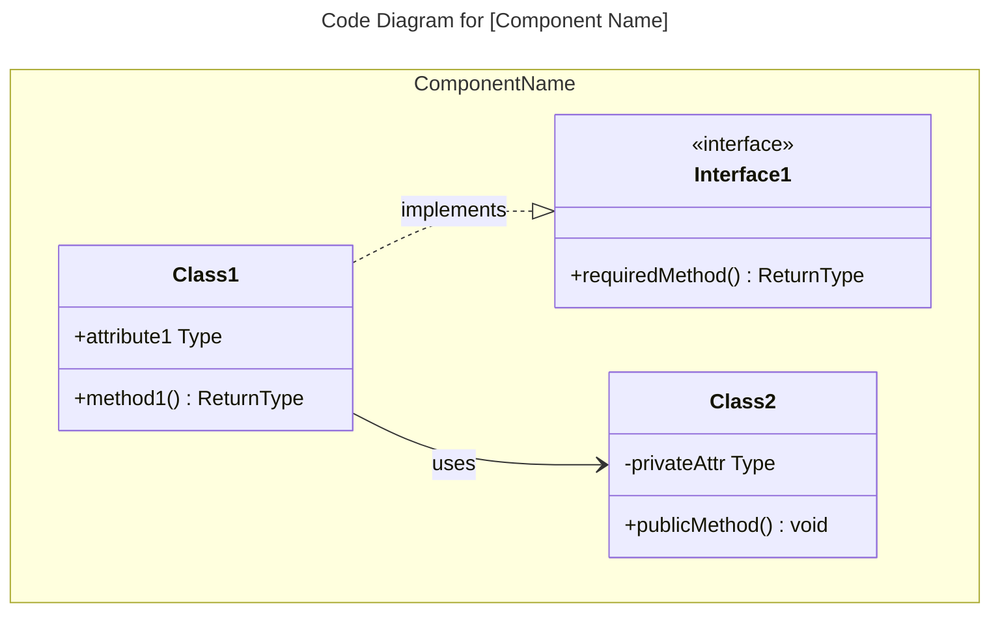
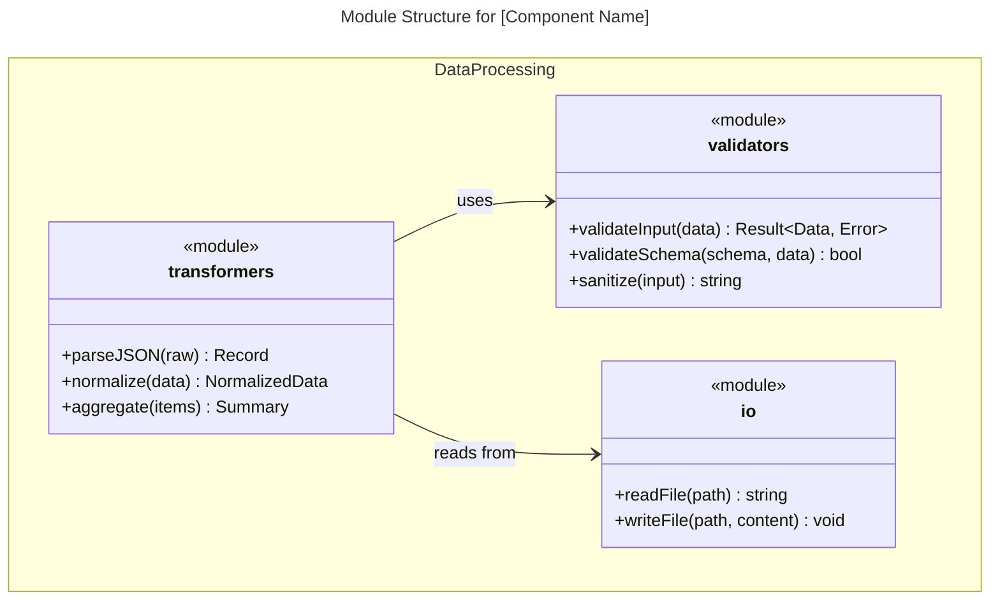
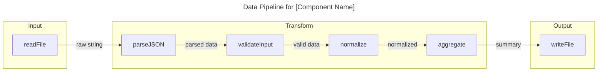
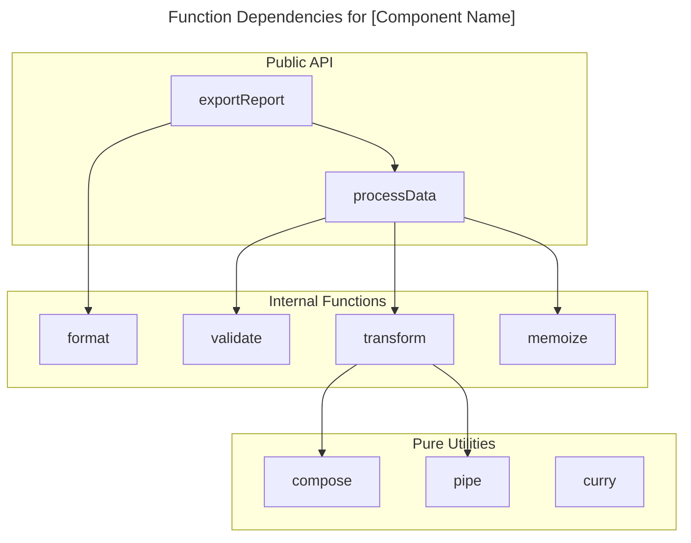

# C4 代码级：[目录名称]

## 使用此技能的场景

- 处理 C4 代码级：[目录名称] 相关任务或工作流
- 需要 C4 代码级：[目录名称] 的指导、最佳实践或检查清单

## 不使用此技能的场景

- 任务与 C4 代码级：[目录名称] 无关
- 需要此范围之外的其他领域或工具

## 指令

- 明确目标、约束和所需输入。
- 应用相关最佳实践并验证结果。
- 提供可执行的步骤和验证方法。
- 如需详细示例，请打开 `resources/implementation-playbook.md`。

## 概述

- **名称**：[此代码目录的描述性名称]
- **描述**：[此代码功能的简短描述]
- **位置**：[实际目录路径的链接]
- **语言**：[主要编程语言]
- **用途**：[此代码实现的目标]

## 代码元素

### 函数/方法

- `functionName(param1: Type, param2: Type): ReturnType`
  - 描述：[此函数的功能]
  - 位置：[文件路径:行号]
  - 依赖：[此函数依赖的内容]

### 类/模块

- `ClassName`
  - 描述：[此类的功能]
  - 位置：[文件路径]
  - 方法：[方法列表]
  - 依赖：[此类依赖的内容]

## 依赖关系

### 内部依赖

- [内部代码依赖列表]

### 外部依赖

- [外部库、框架、服务列表]

## 关系图

可选的 Mermaid 图表，用于展示复杂的代码结构。根据编程范式选择图表类型。代码图展示**单个组件的内部结构**。

### 面向对象代码（类、接口）

对于包含类、接口和继承的 OOP 代码，使用 `classDiagram`：


````

### 函数式/过程式代码（模块、函数）

对于函数式或过程式代码，有两种选择：

**选项 A：模块结构图** - 使用 `classDiagram` 展示模块及其导出函数：



**选项 B：数据流图** - 使用 `flowchart` 展示函数管道和数据转换：



**选项 C：函数依赖图** - 使用 `flowchart` 展示函数调用关系：



### 选择合适的图表

| 代码风格                         | 主要图表                         | 使用场景                                   |
| -------------------------------- | -------------------------------- | ------------------------------------------ |
| OOP（类、接口）                  | `classDiagram`                   | 展示继承、组合、接口实现                   |
| FP（纯函数、管道）               | `flowchart`                      | 展示数据转换和函数组合                     |
| FP（带导出的模块）               | 带有 `<<module>>` 的 `classDiagram` | 展示模块结构和依赖关系                     |
| 过程式（结构体 + 函数）          | `classDiagram`                   | 展示数据结构和相关联的函数                 |
| 混合范式                         | 组合使用                         | 如需要可使用多个图表                       |

**注意**：根据 [C4 模型](https://c4model.com/diagrams)，代码图通常仅在复杂组件需要时创建。大多数团队发现系统上下文图和容器图已足够。选择最能清晰传达代码结构的图表类型，而不受范式限制。

## 备注

[任何额外的上下文或重要信息]

```

## 示例交互

### 面向对象代码库
- "分析 src/api 目录并创建 C4 代码级文档"
- "为服务层代码编写文档，包含完整的类层次结构和依赖关系"
- "创建 C4 代码文档，展示仓储层中的接口实现"

### 函数式/过程式代码库
- "为认证模块中的所有函数编写文档，包含签名和数据流"
- "为 src/pipeline 中的 ETL 转换器创建数据管道图"
- "分析 utils 目录，为所有纯函数及其组合模式编写文档"
- "为 src/handlers 中的 Rust 模块编写文档，展示函数依赖关系"
- "为 Elixir GenServer 模块创建 C4 代码文档"

### 混合范式
- "为 Go handlers 包编写文档，展示结构体及其相关联的函数"
- "分析混合使用类和函数式工具的 TypeScript 代码库"

## 关键区别
- **与 C4-Component 代理的区别**：专注于单个代码元素；Component 代理将多个代码文件合成为组件
- **与 C4-Container 代理的区别**：记录代码结构；Container 代理将组件映射到部署单元
- **与 C4-Context 代理的区别**：提供代码级细节；Context 代理创建高层系统图

## 输出示例
分析代码时，提供：
- 完整的函数/方法签名，包含所有参数和返回类型
- 每个代码元素功能的清晰描述
- 实际源代码位置的链接
- 完整的依赖列表（内部和外部）
- 遵循 C4 代码级模板的结构化文档
- 复杂代码关系所需的 Mermaid 图表
- 所有代码文档中一致的命名和格式

```

## 局限性
- 仅当任务明确符合上述描述的范围时使用此技能。
- 不要将输出视为环境特定验证、测试或专家审查的替代品。
- 如果缺少所需输入、权限、安全边界或成功标准，请停下来请求澄清。
