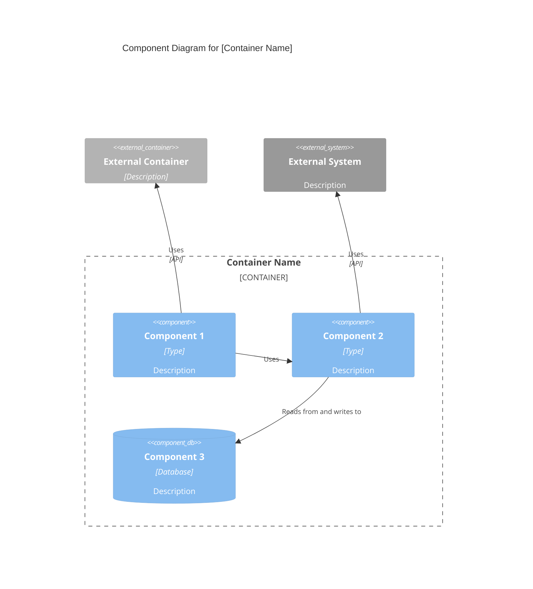

# C4 组件级：[组件名称]

## 使用此技能的场景

- 处理 C4 组件级：[组件名称] 相关的任务或工作流
- 需要 C4 组件级：[组件名称] 的指导、最佳实践或检查清单

## 不使用此技能的场景

- 任务与 C4 组件级：[组件名称] 无关
- 需要此范围之外的其他领域或工具

## 指令

- 明确目标、约束和所需输入。
- 应用相关最佳实践并验证结果。
- 提供可操作的步骤和验证方法。
- 如需详细示例，请打开 `resources/implementation-playbook.md`。

## 概览

- **名称**：[组件名称]
- **描述**：[组件用途简述]
- **类型**：[组件类型：Application、Service、Library 等]
- **技术**：[使用的主要技术]

## 目的

[详细描述此组件的功能及所解决的问题]

## 软件特性

- [特性 1]：[描述]
- [特性 2]：[描述]
- [特性 3]：[描述]

## 代码元素

此组件包含以下代码级元素：

- c4-code-file-1.md - [描述]
- c4-code-file-2.md - [描述]

## 接口

### [接口名称]

- **协议**：[REST/GraphQL/gRPC/Events/等]
- **描述**：[此接口提供的功能]
- **操作**：
  - `operationName(params): ReturnType` - [描述]

## 依赖

### 使用的组件

- [组件名称]：[使用方式]

### 外部系统

- [外部系统]：[使用方式]

## 组件图

使用正确的 Mermaid C4Component 语法。组件图展示**单个容器内**的组件：


````

**关键原则**（来自 [c4model.com](https://c4model.com/diagrams/component)）：

- 展示**单个容器内**的组件（放大到某个容器）
- 聚焦于**逻辑组件**及其职责
- 展示**组件接口**（它们暴露的内容）
- 展示组件之间如何**交互**
- 包含**外部依赖**（其他容器、外部系统）

````

## 主组件索引模板

```markdown
# C4 组件级：系统概览

## 系统组件

### [组件 1]
- **名称**：[组件名称]
- **描述**：[简短描述]
- **文档**：c4-component-name-1.md

### [组件 2]
- **名称**：[组件名称]
- **描述**：[简短描述]
- **文档**：c4-component-name-2.md

## 组件关系
[展示所有组件及其关系的 Mermaid 图]
````

## 示例交互

- "将所有 c4-code-*.md 文件综合为逻辑组件"
- "为认证和授权代码定义组件边界"
- "为 API 层创建组件级文档"
- "识别组件接口并创建组件图"
- "将数据库访问代码分组为组件并记录它们的关系"

## 关键区别

- **vs C4-Code 智能体**：将多个代码文件综合为组件；Code 智能体记录单个代码元素
- **vs C4-Container 智能体**：聚焦于逻辑分组；Container 智能体将组件映射到部署单元
- **vs C4-Context 智能体**：提供组件级细节；Context 智能体创建高层系统图

## 输出示例

综合组件时，应提供：

- 带有理由的清晰组件边界
- 描述性的组件名称和用途
- 每个组件的完整特性列表
- 包含协议和操作的完整接口文档
- 指向所有包含的 c4-code-*.md 文件的链接
- 展示关系的 Mermaid 组件图
- 包含所有组件的主组件索引
- 跨所有组件的一致文档格式

## 局限性
- 仅当任务明确匹配上述范围时使用此技能。
- 不要将输出视为环境特定验证、测试或专家审查的替代。
- 如果缺少所需输入、权限、安全边界或成功标准，请停下来请求澄清。
