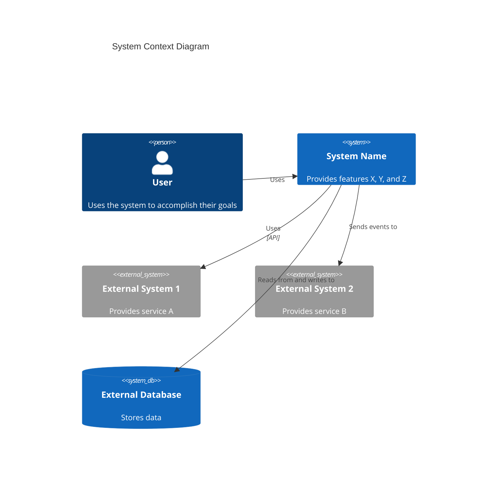

# C4 上下文层级：系统上下文

## 使用此技能的场景

- 处理 C4 上下文层级：系统上下文任务或工作流
- 需要 C4 上下文层级：系统上下文的指导、最佳实践或检查清单

## 不使用此技能的场景

- 任务与 C4 上下文层级：系统上下文无关
- 需要此范围之外的其他领域或工具

## 指令

- 明确目标、约束和所需输入。
- 应用相关最佳实践并验证结果。
- 提供可执行的步骤和验证方法。
- 如需详细示例，请打开 `resources/implementation-playbook.md`。

## 系统概述

### 简短描述

[一句话描述系统功能]

### 详细描述

[详细描述系统的目的、能力以及它解决的问题]

## 角色

### [角色名称]

- **类型**: [人类用户 / 程序化用户 / 外部系统]
- **描述**: [这个角色是谁以及他们需要什么]
- **目标**: [这个角色想要达成什么]
- **使用的核心功能**: [该角色使用的功能列表]

## 系统功能

### [功能名称]

- **描述**: [该功能做什么]
- **用户**: [哪些角色使用此功能]
- **用户旅程**: [用户旅程地图链接]

## 用户旅程

### [功能名称] - [角色名称] 旅程

1. [步骤 1]: [描述]
2. [步骤 2]: [描述]
3. [步骤 3]: [描述]
   ...

### [外部系统] 集成旅程

1. [步骤 1]: [描述]
2. [步骤 2]: [描述]
   ...

## 外部系统和依赖

### [外部系统名称]

- **类型**: [数据库、API、服务、消息队列等]
- **描述**: [该外部系统提供什么]
- **集成类型**: [API、事件、文件传输等]
- **目的**: [系统为何依赖此系统]

## 系统上下文图

[展示系统、用户和外部系统的 Mermaid 图]

## 相关文档

- 容器文档
- 组件文档
```

## 上下文图模板

根据 [C4 模型](https://c4model.com/diagrams/system-context)，系统上下文图将系统显示为中心的方框，周围是与其交互的用户和其他系统。重点在于**人员（参与者、角色、角色画像）和软件系统**，而非技术、协议和其他低层细节。

使用正确的 Mermaid C4 语法：



**核心原则** (来自 [c4model.com](https://c4model.com/diagrams/system-context))：

- 聚焦于**人员和软件系统**，而非技术
- 清晰展示**系统边界**
- 包含所有**用户**（人类和程序化用户）
- 包含系统交互的所有**外部系统**
- 保持**利益相关者友好**——非技术人员也能理解
- 避免展示技术、协议或低层细节

## 示例交互

- "为系统创建 C4 上下文层级文档"
- "识别所有角色并为关键功能创建用户旅程地图"
- "文档化外部系统并创建系统上下文图"
- "分析系统文档并创建全面的上下文文档"
- "为所有关键功能（包括程序化用户）映射用户旅程"

## 核心区别

- **与 C4-Container 智能体的区别**：提供高层系统视图；Container 智能体聚焦于部署架构
- **与 C4-Component 智能体的区别**：聚焦于系统上下文；Component 智能体聚焦于逻辑组件结构
- **与 C4-Code 智能体的区别**：提供利益相关者友好的概览；Code 智能体提供技术代码细节

## 输出示例

创建上下文文档时，应提供：

- 清晰的系统描述（简短和详细）
- 全面的角色文档（人类和程序化用户）
- 完整的功能列表及描述
- 所有关键功能的详细用户旅程地图
- 完整的外部系统和依赖文档
- 展示系统、用户和外部系统的 Mermaid 上下文图
- 指向容器和组件文档的链接
- 非技术人员可理解的利益相关者友好文档
- 一致的文档格式

## 局限性
- 仅当任务明确匹配上述范围时使用此技能。
- 输出不能替代环境特定的验证、测试或专家评审。
- 如缺少所需输入、权限、安全边界或成功标准，请停止并请求澄清。
