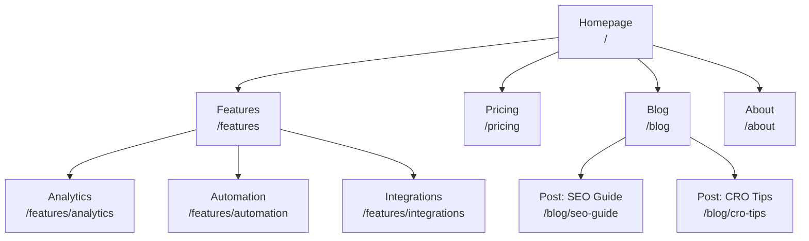
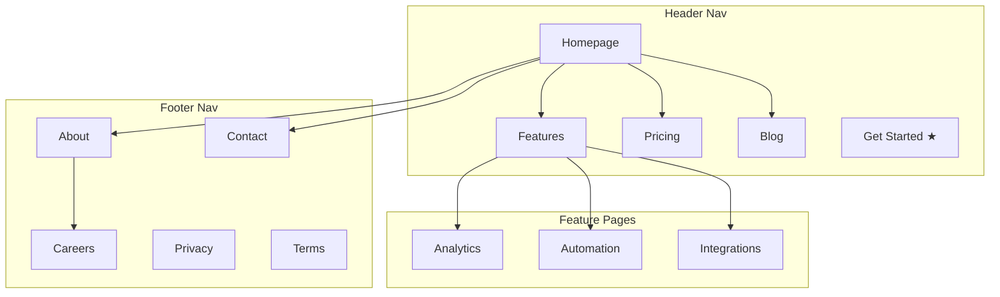
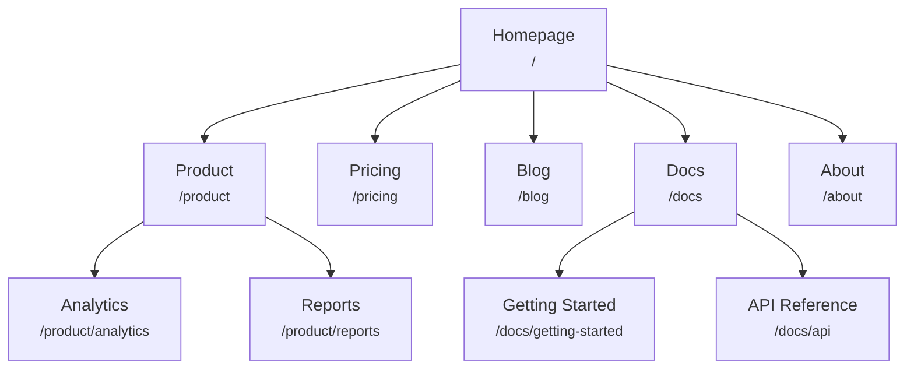
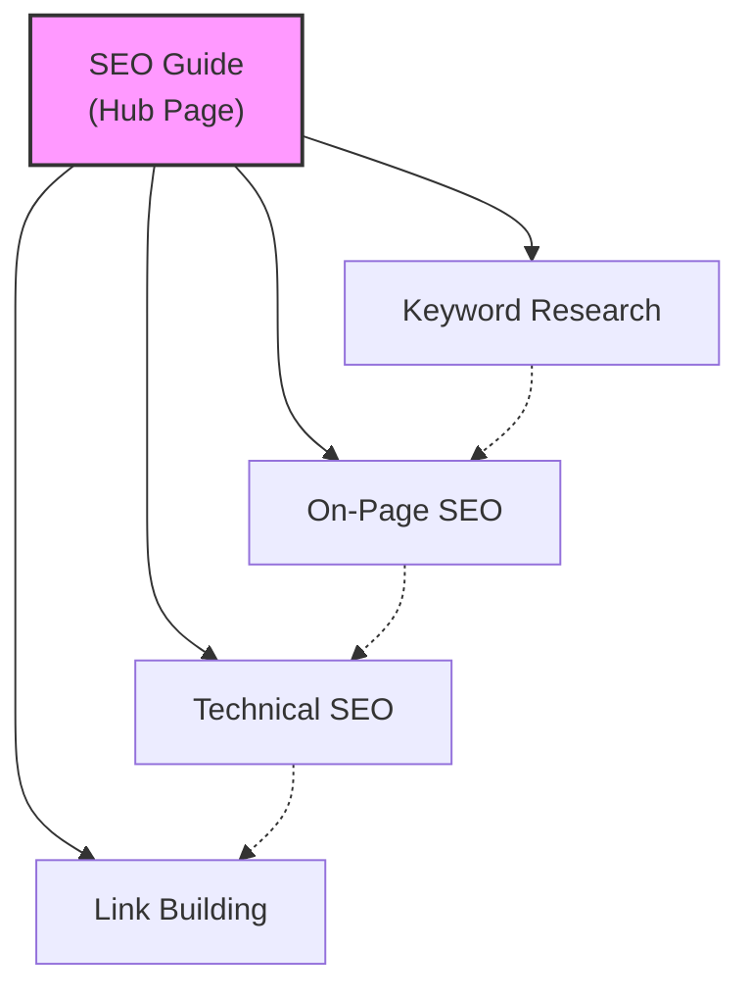
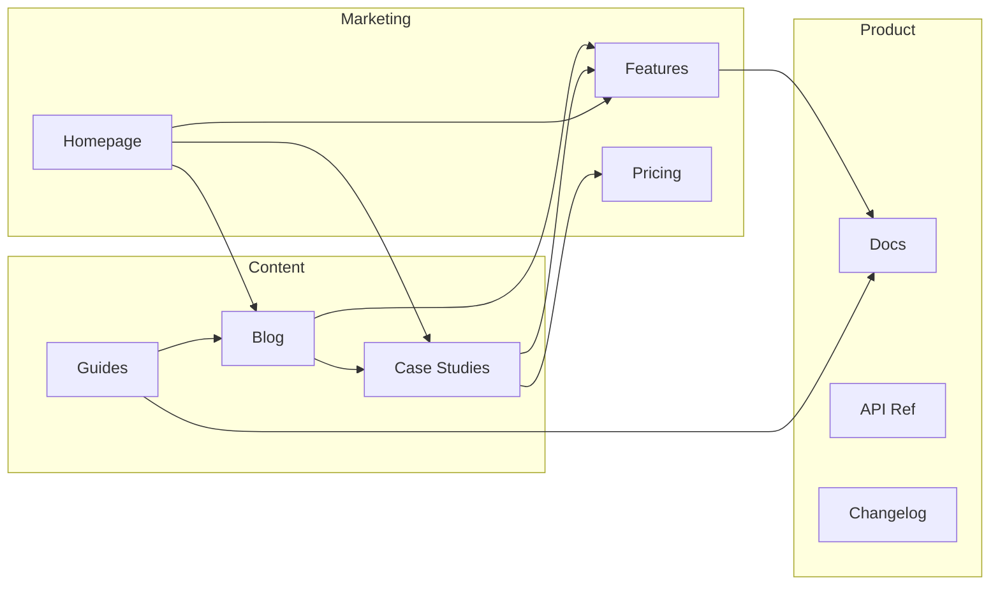
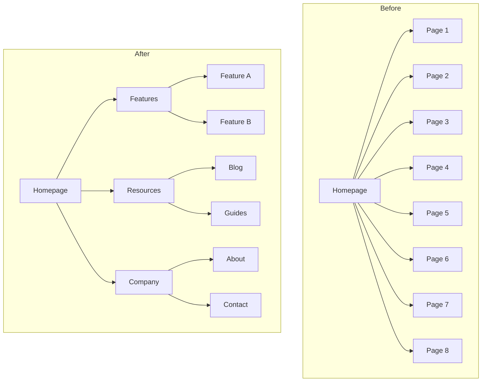
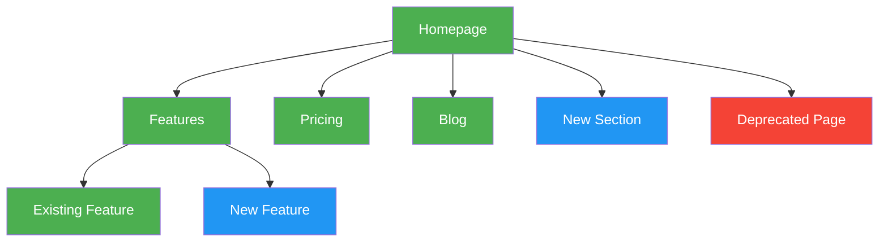

# Mermaid 图表模板

可直接复制粘贴的 Mermaid 图表，用于可视化站点地图。根据您的网站自定义节点标签和连接。

---

## 基础层级结构

简单的自上而下页面层级。

---

## 带导航区域的层级结构

使用子图显示哪些页面出现在哪个导航区域。

---

## 带 URL 标签的层级结构

每个节点显示页面名称和 URL 路径。

---

## 中心辐射内容模型

显示一个中心页面连接到辐射文章，辐射文章之间相互链接。

图例：
- 实线 = 主要中心辐射链接
- 虚线 = 辐射之间的交叉链接

---

## 内部链接流

显示不同网站部分如何相互链接。

---

## 重构前后对比

并排比较当前和提议的网站结构。

---

## 颜色编码约定

使用样式突出显示页面状态、优先级或类型。

颜色说明：
- **绿色** (`#4CAF50`)：现有页面（无更改）
- **蓝色** (`#2196F3`)：需要创建的新页面
- **红色** (`#f44336`)：需要删除或重定向的页面
- **黄色** (`#FFC107`)：需要重构或移动的页面
- **紫色** (`#9C27B0`)：高优先级 / CTA 页面