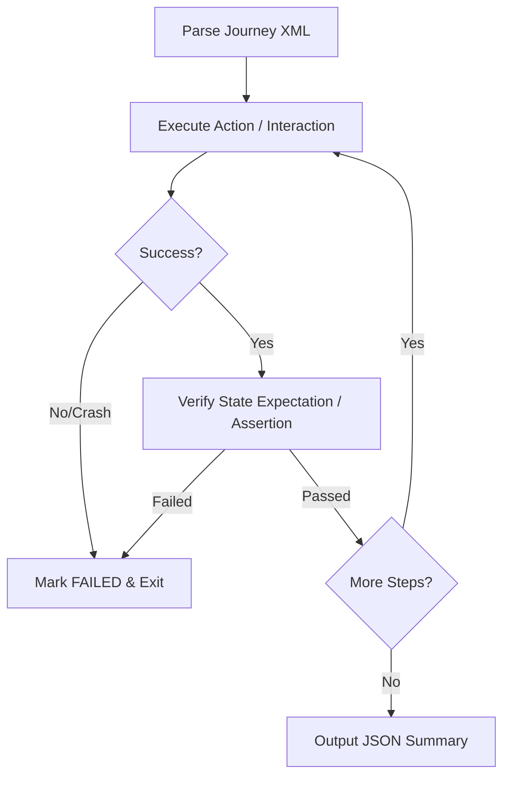

# Android UI 旅程测试

## 概述

本技能概述了在 Android 应用上运行 XML 规范的用户旅程（User Journey）测试的标准工作流程。所谓“旅程”，是一组按顺序排列的用户操作与状态断言，用于验证端到端功能。旅程 XML 作为应用行为的唯一事实来源，执行器按顺序推进，执行 UI 交互、检查状态断言，并写入一份标准化的 JSON 结果报告。

## 适用场景

- 需要根据 XML 测试规范评估 Android 应用的 UI 行为时使用。
- 需要自动化多步骤用户流程（例如登录、结算、导航）并校验预期结果时使用。
- 需要运行验证测试并生成标准化 JSON 测试报告时使用。
- 需要使用 ADB 命令在真机或模拟器上调试应用流程时使用。

## 工作原理



### 步骤一：解析旅程规范

读取并解析 XML 测试套件结构。根节点 `<journey>` 定义测试用例名称，`<actions>` 块包含测试步骤序列。

```xml
<journey name="Search and Cart Flow">
   <description>Verify that searching for an item and adding it to the cart succeeds.</description>
   <actions>
      <action>Search for soda</action>
      <action>Tap the first search result</action>
      <action>Verify that the product detail screen is shown</action>
   </actions>
</journey>
```

### 步骤二：顺序步骤评估

按指定顺序依次处理每个 `<action>` 元素。测试步骤分为两类：

#### A. 交互动作（点击、滑动、文本输入）

通过 ADB 执行具体的 UI 交互操作。

- **点击**：点击目标元素边界框的中心：
  ```bash
  adb shell input tap <x> <y>
  ```
- **滑动 / 滚动**：从一个坐标滑动到另一个坐标，并指定持续时间：
  ```bash
  adb shell input swipe <x1> <y1> <x2> <y2> <duration_ms>
  ```
- **文本输入**：在当前激活的输入框中输入文本：
  ```bash
  adb shell input text "<string>"
  ```
  如果元素缺失或无法执行该动作，则当前动作失败，整个旅程标记为失败。

#### B. 状态断言（预期校验）

以“verify”、“check”或“ensure”开头的步骤表示状态断言。

- 检查当前屏幕（通过截图或 `uiautomator dump`），不进行交互或滚动。
- 确认所有子断言均满足。例如，“验证应用位于主屏幕且 Logo 可见”：若主屏幕未显示**或** Logo 缺失，则断言失败。

### 步骤三：处理失败与崩溃

如果应用发生崩溃、退出、卡顿或断言失败：

1. 立即停止旅程执行。
2. 将失败步骤标记为 `FAILED`。
3. 将其后续所有步骤标记为 `SKIPPED`。
4. 记录失败的具体原因。

### 步骤四：生成 JSON 报告

将执行结果按照标准化 JSON 结构格式化，并写入输出日志。

---

## 示例

### 示例一：完整的旅程 XML 规范

```xml
<journey name="Login and Profile Edit">
   <description>Logs into the app, navigates to settings, and changes user profile information.</description>
   <actions>
      <action>Verify that the username input field is visible</action>
      <action>Tap the username input field</action>
      <action>Type "testuser" into the input</action>
      <action>Tap the password input field</action>
      <action>Type a redacted test password into the input</action>
      <action>Tap the "Login" button</action>
      <action>Verify that the Home dashboard is visible and user profile photo is shown</action>
   </actions>
</journey>
```

### 示例二：标准 JSON 结果报告

```json
{
  "journey": "Login and Profile Edit",
  "results": [
    {
      "action": "Verify that the username input field is visible",
      "status": "PASSED",
      "commands": [],
      "comment": "Username input detected at bounds [100,200][980,300] via UI dump."
    },
    {
      "action": "Tap the username input field",
      "status": "PASSED",
      "commands": [
        "adb shell input tap 540 250"
      ],
      "comment": "Tapped center coordinates of username input."
    },
    {
      "action": "Type \"testuser\" into the input",
      "status": "PASSED",
      "commands": [
        "adb shell input text \"testuser\""
      ],
      "comment": "Username typed successfully."
    },
    {
      "action": "Tap the password input field",
      "status": "PASSED",
      "commands": [
        "adb shell input tap 540 370"
      ],
      "comment": "Tapped center of password input."
    },
    {
      "action": "Type a redacted test password into the input",
      "status": "PASSED",
      "commands": [
        "adb shell input text \"[REDACTED_PASSWORD]\""
      ],
      "comment": "Password typed successfully. The actual input value was not stored in the report."
    },
    {
      "action": "Tap the \"Login\" button",
      "status": "PASSED",
      "commands": [
        "adb shell input tap 540 500"
      ],
      "comment": "Login button clicked."
    },
    {
      "action": "Verify that the Home dashboard is visible and user profile photo is shown",
      "status": "FAILED",
      "commands": [],
      "comment": "Dashboard loaded but profile photo was missing from the UI header."
    }
  ]
}
```

---

## 最佳实践

- ✅ **计算点击中心点**：解析形如 `[x1,y1][x2,y2]` 的元素边界时，始终计算其中心坐标：
  $$x_{center} = \frac{x_1 + x_2}{2}, \quad y_{center} = \frac{y_1 + y_2}{2}$$
- ✅ **加入等待缓冲**：在交互动作（如按钮点击）之后，务必添加短暂延迟（例如 1–2 秒），以便布局与过渡动画渲染完成后再执行断言。
- ✅ **快速失败**：遇到第一个失败时立即停止测试。失败后继续执行将产生无效结果。
- ✅ **安全记录精确命令**：在 JSON 输出列表中记录非敏感的原始命令（如 `adb shell input tap`）用于诊断。对输入到密码、OTP、令牌、支付或个人数据字段的文本进行脱敏处理，绝不在报告、CI 日志或共享制品中保存明文密钥。

## 局限性

- 解析器仅评估静态屏幕层级（例如 `uiautomator dump`）。需要滚动才能看到的元素，除非显式执行滚动动作，否则会被判定为不可见。
- 非标准 UI 组件（例如自定义 OpenGL 画布视图）无法通过标准无障碍树读取，可能需要截图分析或硬编码点击坐标。
- 通过 ADB 触发的按键事件与文本输入，并非在所有模拟器镜像上都会产生标准的软键盘事件，可能导致输入校验出现问题。

## 相关技能

- `@android-cli` — 通用 CLI 工具语法、包安装与设备查询。
- `@android_ui_verification` — 面向通用 UI 检查的直接 ADB 脚本模板。