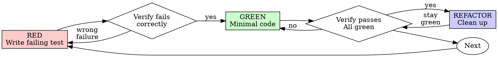

# 测试驱动开发（TDD）

## 概述

先写测试。看着它失败。写最少的代码让它通过。

**核心原则：** 如果你没看到测试失败，就无法确认它测对了东西。

**违反规则的字面意思，就是违反规则的精神。**

## 适用场景
**始终适用：**
- 新功能
- Bug 修复
- 重构
- 行为变更

**例外情况（需与协作伙伴确认）：**
- 一次性原型
- 自动生成的代码
- 配置文件

想"就这一次跳过 TDD"？停下来。那是自我合理化。

## 铁律

```
没有失败的测试，就没有生产代码
```

先写了代码再补测试？删掉。从头来。

**没有例外：**
- 不要留着当"参考"
- 不要在写测试时"改编"它
- 不要去看它
- 删掉就是删掉

从测试出发全新实现。没有商量余地。

## 红-绿-重构



### RED - 写一个失败的测试

写一个最小的测试，说明预期行为。

<Good>
```typescript
test('retries failed operations 3 times', async () => {
  let attempts = 0;
  const operation = () => {
    attempts++;
    if (attempts < 3) throw new Error('fail');
    return 'success';
  };

  const result = await retryOperation(operation);

  expect(result).toBe('success');
  expect(attempts).toBe(3);
});
```
命名清晰，测试真实行为，只测一件事
</Good>

<Bad>
```typescript
test('retry works', async () => {
  const mock = jest.fn()
    .mockRejectedValueOnce(new Error())
    .mockRejectedValueOnce(new Error())
    .mockResolvedValueOnce('success');
  await retryOperation(mock);
  expect(mock).toHaveBeenCalledTimes(3);
});
```
命名模糊，测的是 mock 而非代码
</Bad>

**要求：**
- 只测一个行为
- 命名清晰
- 使用真实代码（除非不可避免，否则不用 mock）

### 验证 RED - 看着它失败

**强制执行。不可跳过。**

```bash
npm test path/to/test.test.ts
```

确认：
- 测试失败（不是报错）
- 失败信息符合预期
- 失败原因是功能缺失（不是拼写错误）

**测试通过了？** 你在测已有行为。修改测试。

**测试报错了？** 修错，重新运行直到它正确地失败。

### GREEN - 最少代码

写最简单的代码让测试通过。

<Good>
```typescript
async function retryOperation<T>(fn: () => Promise<T>): Promise<T> {
  for (let i = 0; i < 3; i++) {
    try {
      return await fn();
    } catch (e) {
      if (i === 2) throw e;
    }
  }
  throw new Error('unreachable');
}
```
刚好够用
</Good>

<Bad>
```typescript
async function retryOperation<T>(
  fn: () => Promise<T>,
  options?: {
    maxRetries?: number;
    backoff?: 'linear' | 'exponential';
    onRetry?: (attempt: number) => void;
  }
): Promise<T> {
  // YAGNI
}
```
过度设计
</Bad>

不要添加功能、重构其他代码，或超出测试范围"改进"。

### 验证 GREEN - 看着它通过

**强制执行。**

```bash
npm test path/to/test.test.ts
```

确认：
- 测试通过
- 其他测试仍然通过
- 输出干净（无错误、无警告）

**测试失败？** 修代码，不是修测试。

**其他测试也失败了？** 立即修复。

### REFACTOR - 清理

仅在绿灯后进行：
- 消除重复
- 改进命名
- 提取辅助函数

保持测试绿色。不添加新行为。

### 重复

为下一个功能写下一个失败的测试。

## 好测试的标准

| 质量维度 | 好 | 差 |
|---------|------|-----|
| **最小化** | 只测一件事。名字里有"和"？拆开。 | `test('validates email and domain and whitespace')` |
| **清晰** | 命名描述行为 | `test('test1')` |
| **意图明确** | 展示期望的 API 用法 | 模糊了代码该做什么 |

## 顺序为什么重要

**"我写完代码再补测试来验证"**

后补的测试一跑就过。立刻通过什么都证明不了：
- 可能测错了东西
- 可能测的是实现细节而非行为
- 可能遗漏了你忘记的边界情况
- 你从没见过它抓到 bug

先写测试迫使你看到它失败，证明它确实在测东西。

**"我已经手动测过所有边界情况了"**

手动测试是临时的。你以为测全了，但实际上：
- 没有测试记录
- 代码改了无法重跑
- 压力下容易漏掉场景
- "我试的时候好使" ≠ 全面覆盖

自动化测试是系统性的。每次都以相同方式运行。

**"删掉 X 小时的工作太浪费了"**

沉没成本谬误。时间已经花了。你现在有两个选择：
- 删掉用 TDD 重写（多花 X 小时，高置信度）
- 留着补测试（30 分钟，低置信度，可能有 bug）

真正的"浪费"是留下你无法信任的代码。能跑但没有真正测试的代码就是技术债。

**"TDD 太教条了，务实就是灵活变通"**

TDD 才是务实的：
- 提交前就发现 bug（比上线后调试更快）
- 防止回归（测试立刻捕获破坏）
- 记录行为（测试展示代码用法）
- 支持重构（自由修改，测试捕获破坏）

"务实"的捷径 = 生产环境调试 = 更慢。

**"后补测试也能达到同样目的——重精神不重形式"**

不能。后补测试回答的是"这代码做了什么？"先写测试回答的是"这代码该做什么？"

后补测试受你的实现影响。你测的是你造出来的东西，不是需求要求的东西。你验证的是记住的边界情况，不是发现的。

先写测试迫使你在实现前发现边界情况。后补测试验证你是否都记住了（你没有）。

30 分钟后补测试 ≠ TDD。你得到了覆盖率，失去了测试有效的证明。

## 常见合理化借口

| 借口 | 现实 |
|--------|---------|
| "太简单不用测" | 简单代码也会出错。测试只需 30 秒。 |
| "我之后再测" | 立刻通过的测试什么都证明不了。 |
| "后补测试也能达到目的" | 后补 = "这做了什么？" 先写 = "这该做什么？" |
| "已经手动测过了" | 临时 ≠ 系统。没记录，无法重跑。 |
| "删掉 X 小时太浪费" | 沉没成本谬误。留下未经验证的代码是技术债。 |
| "留着当参考，先写测试" | 你一定会改编它。那就是后补测试。删掉就是删掉。 |
| "需要先探索" | 可以。探索完扔掉，从 TDD 开始。 |
| "测试难写 = 设计不清晰" | 听测试的。难测 = 难用。 |
| "TDD 会拖慢我" | TDD 比调试快。务实 = 先写测试。 |
| "手动测试更快" | 手动证明不了边界情况。每次改动都要重测。 |
| "现有代码没测试" | 你在改进它。为现有代码补测试。 |

## 危险信号 - 停下来重新开始

- 先写代码后补测试
- 实现之后才写测试
- 测试一跑就过
- 说不清测试为什么失败
- 测试"之后再加"
- 合理化"就这一次"
- "我已经手动测过了"
- "后补测试也能达到目的"
- "重精神不重形式"
- "留着当参考"或"改编现有代码"
- "已经花了 X 小时，删掉太浪费"
- "TDD 太教条，我这是务实"
- "这次不一样，因为……"

**以上所有情况意味着：删掉代码。用 TDD 从头来。**

## 示例：Bug 修复

**Bug：** 接受了空邮箱

**RED**
```typescript
test('rejects empty email', async () => {
  const result = await submitForm({ email: '' });
  expect(result.error).toBe('Email required');
});
```

**验证 RED**
```bash
$ npm test
FAIL: expected 'Email required', got undefined
```

**GREEN**
```typescript
function submitForm(data: FormData) {
  if (!data.email?.trim()) {
    return { error: 'Email required' };
  }
  // ...
}
```

**验证 GREEN**
```bash
$ npm test
PASS
```

**REFACTOR**
如需要，提取多字段的校验逻辑。

## 验证清单

标记工作完成前：

- [ ] 每个新函数/方法都有测试
- [ ] 实现前看到每个测试失败
- [ ] 每个测试因预期原因失败（功能缺失，不是拼写错误）
- [ ] 写最少代码让每个测试通过
- [ ] 所有测试通过
- [ ] 输出干净（无错误、无警告）
- [ ] 测试使用真实代码（仅在不可避免时使用 mock）
- [ ] 边界情况和错误已覆盖

无法全部勾选？你跳过了 TDD。重新来。

## 遇到困难时

| 问题 | 解决方案 |
|---------|----------|
| 不知道怎么测 | 写出期望的 API。先写断言。请教协作伙伴。 |
| 测试太复杂 | 设计太复杂。简化接口。 |
| 必须 mock 所有东西 | 代码耦合太紧。用依赖注入。 |
| 测试准备代码太多 | 提取辅助函数。仍然复杂？简化设计。 |

## 调试集成

发现 bug？写一个复现它的失败测试。遵循 TDD 循环。测试证明修复有效并防止回归。

永远不要在没有测试的情况下修 bug。

## 测试反模式

添加 mock 或测试工具时，阅读 @testing-anti-patterns.md 避免常见陷阱：
- 测试 mock 行为而非真实行为
- 在生产类中添加仅测试使用的方法
- 不理解依赖关系就盲目 mock

## 最终规则

```
生产代码 → 测试存在且先失败过
否则 → 不是 TDD
```

没有协作伙伴的许可，没有例外。

## 局限性
- 仅在任务明确匹配上述范围时使用此技能。
- 不要将输出视为环境特定验证、测试或专家评审的替代品。
- 如果缺少必要输入、权限、安全边界或成功标准，请停下来请求澄清。
