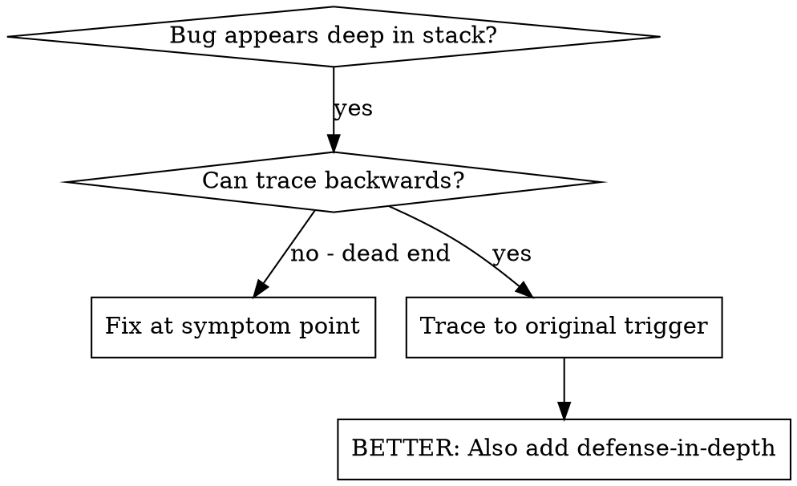
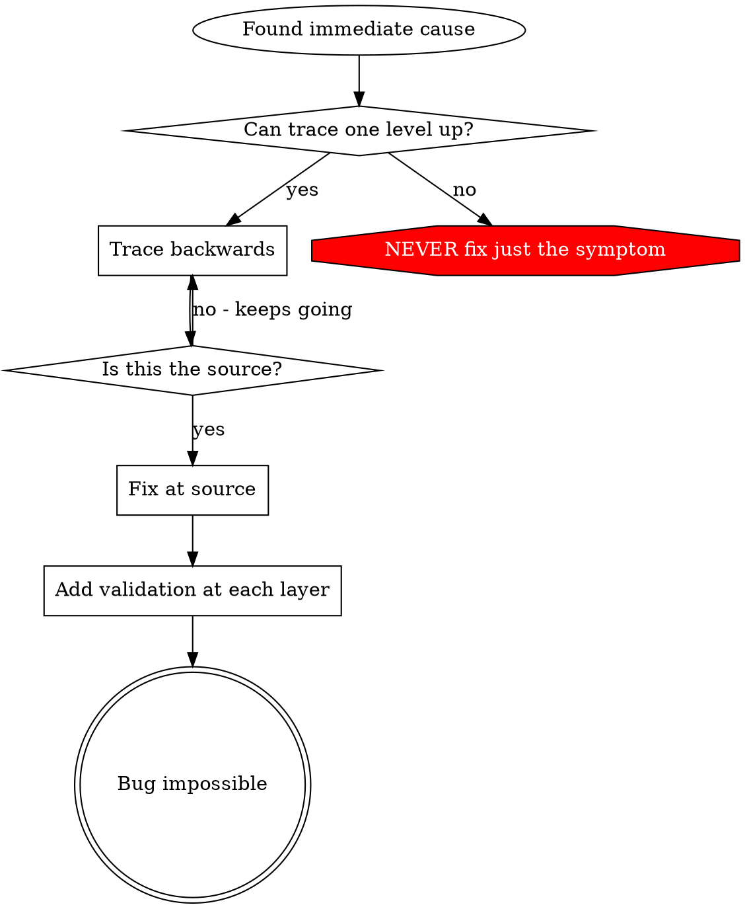

# 根因追踪

## 概述

Bug 往往表现在调用栈深处（git init 到了错误目录、文件创建在错误位置、数据库以错误路径打开）。你的本能是在出错的地方修复，但那只是治标。

**核心原则：** 沿调用链反向追踪，直到找到原始触发点，然后在源头修复。

## 使用场景



**适用情况：**
- 错误发生在执行深处（而非入口点）
- 堆栈跟踪显示长长的调用链
- 不清楚无效数据从哪里来
- 需要找到是哪个测试/代码触发了问题

## 追踪流程

### 1. 观察症状
```
Error: git init failed in /Users/jesse/project/packages/core
```

### 2. 找到直接原因
**哪段代码直接导致了这个错误？**
```typescript
await execFileAsync('git', ['init'], { cwd: projectDir });
```

### 3. 问：谁调用了这个？
```typescript
WorktreeManager.createSessionWorktree(projectDir, sessionId)
  → called by Session.initializeWorkspace()
  → called by Session.create()
  → called by test at Project.create()
```

### 4. 持续向上追踪
**传入了什么值？**
- `projectDir = ''`（空字符串！）
- 空字符串作为 `cwd` 会解析为 `process.cwd()`
- 那就是源码目录！

### 5. 找到原始触发点
**空字符串从哪来？**
```typescript
const context = setupCoreTest(); // Returns { tempDir: '' }
Project.create('name', context.tempDir); // Accessed before beforeEach!
```

## 添加堆栈追踪

无法手动追踪时，添加插桩：

```typescript
// Before the problematic operation
async function gitInit(directory: string) {
  const stack = new Error().stack;
  console.error('DEBUG git init:', {
    directory,
    cwd: process.cwd(),
    nodeEnv: process.env.NODE_ENV,
    stack,
  });

  await execFileAsync('git', ['init'], { cwd: directory });
}
```

**关键：** 测试中用 `console.error()`（不要用 logger——可能不会输出）

**运行并捕获：**
```bash
npm test 2>&1 | grep 'DEBUG git init'
```

**分析堆栈跟踪：**
- 寻找测试文件名
- 找到触发调用的行号
- 识别模式（同一个测试？同一个参数？）

## 找出哪个测试造成了污染

如果测试中出现异常但不知道是哪个测试：

使用本目录下的二分脚本 `find-polluter.sh`：

```bash
./find-polluter.sh '.git' 'src/**/*.test.ts'
```

逐个运行测试，在第一个污染者处停止。详见脚本说明。

## 真实案例：空 projectDir

**症状：** `.git` 创建在 `packages/core/`（源码目录）

**追踪链：**
1. `git init` 在 `process.cwd()` 执行 ← cwd 参数为空
2. WorktreeManager 收到空的 projectDir
3. Session.create() 传入了空字符串
4. 测试在 beforeEach 之前访问了 `context.tempDir`
5. setupCoreTest() 初始返回 `{ tempDir: '' }`

**根因：** 顶层变量初始化时访问了空值

**修复：** 将 tempDir 改为 getter，在 beforeEach 之前访问时抛出异常

**同时添加了纵深防御：**
- 第 1 层：Project.create() 验证目录
- 第 2 层：WorkspaceManager 验证非空
- 第 3 层：NODE_ENV 守卫拒绝在 tmpdir 之外执行 git init
- 第 4 层：git init 前记录堆栈跟踪

## 核心原则



**永远不要只在出错的地方修复。** 追踪回去找到原始触发点。

## 堆栈追踪技巧

**测试中：** 用 `console.error()` 而非 logger——logger 可能被抑制
**操作前：** 在危险操作之前记录，而非失败之后
**包含上下文：** 目录、cwd、环境变量、时间戳
**捕获堆栈：** `new Error().stack` 显示完整调用链

## 实际效果

来自调试会话（2025-10-03）的数据：
- 通过 5 层追踪找到根因
- 在源头修复（getter 验证）
- 添加了 4 层防御
- 1847 个测试通过，零污染
