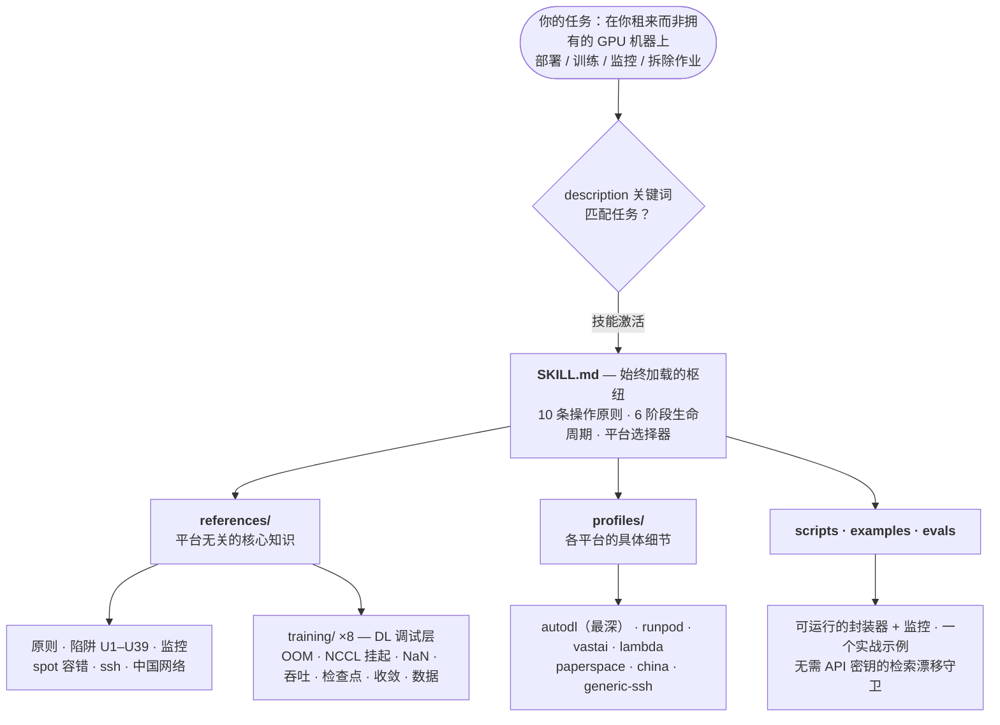
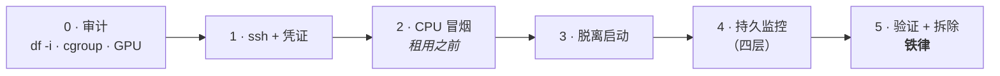

# remote-gpu-trainer

**一个用于在租来的 GPU 机器上运行长任务的 Agent Skill。** 跨 [AutoDL](https://www.autodl.com)、RunPod、vast.ai、Lambda、Paperspace、国内平台（恒源云 / 矩池云 / Featurize / 揽睿星舟）、裸 SSH 机器、Slurm 和 Kubernetes 安全地部署、训练、监控和拆除。单实例，或多实例扇出。

[](LICENSE)
[](https://agentskills.io)
[](https://agentskills.io/specification)
[](#whats-inside)
[](#verification-status)

> **消歧义：** 这里的"AutoDL"是 **autodl.com** GPU 租赁平台，不是 AutoML 或 NAS。而且这是一个 **Agent Skill** — 一个带有参考文档和脚本模板的 `SKILL.md` — 不是 CLI 或 SDK。它运行*在*各平台 API 之上，编码了那些 API 遗漏的运维生存知识。

整个技能建立在一个心智模型上：**你是别人机器上的短期租客。** 所以它教的是租客生存法则 — 让作业脱离终端、让结果比机器活得更久、在不丢数据的情况下停止计费 — 并将此作为跨所有后端的统一模型。只有各平台的差异（停止 vs 销毁的计费、机器锁定的网盘、`/root` 的易失性、加速代理 vs HF 镜像、spot 宽限）被下沉到每个平台一个配置文件中。



## 目录

[为什么存在](#为什么存在) · [有何不同](#有何不同) ·
[架构与布局](#架构与布局) · [安装与部署](#安装与部署) ·
[包含内容](#包含内容) · [范围](#范围) · [验证状态](#验证状态) ·
[免责声明](#免责声明) · [中文简介](#中文简介) · [贡献](#贡献) ·
[许可证](#许可证) · [引用](#引用)

## 为什么存在

租一台 GPU 是容易的部分。昂贵的意外来自作业周围的一切：一台停掉的机器悄悄继续计费、一个"已同步"的检查点因为磁盘 inode 耗尽而实际从未写入、一次下载因为错误的镜像而卡住、一个 `terminate` 删除了一周训练的唯一副本。这些都不在平台的 API 文档中，而且大多数只在已经付了钱之后才咬人。

这个技能将这类知识收集成智能体可以执行的形式：十条操作原则说明每步*为何*重要、一个六阶段生命周期以可运行的检查结束每个阶段、每个平台一个配置文件钉住具体命令。它在花钱和丢数据的事情上有明确立场，其他方面保持安静。

## 有何不同

通用编排器 — **SkyPilot**、**dstack**、**Modal** — 拥有或抽象基础设施，并在西方云之间比价。它们在这方面很出色，本技能不与之竞争。但它们都不支持 AutoDL 或国内平台，且每个都假设自己的守护进程或集群模型。

`remote-gpu-trainer` 在**你已经控制的原始租用实例**上与你相遇，并集中解决那些工具留下的盲区：国内平台和裸 SSH 廉价租卡，那里的磁盘预算设计、inode 上限、镜像卡顿、cgroup OOM、spot 宽限窗口和*不可逆*的拆除才是真正的工作。两种方法互补：让 SkyPilot 或 dstack 帮你管理机器，然后让这个技能使你的*代码*恢复正确，这样它们的恢复才能真正还原进度。

## 架构与布局

设计遵循 Agent Skills 的**渐进式披露**理念：一个小的始终加载的枢纽，更深的材料只在需要时加载。使其可移植的拆分是**平台无关的核心，平台特定的边缘** — 原则和生命周期到处适用，每条具体路径、代理、计费命令和 spot 规则只存在于一个地方：配置文件。

六阶段生命周期是操作脊骨。每个阶段将其底层细节委托给当前配置文件，并以一个可运行的检查结束：



文件夹直接映射到该架构：

```text
remote-gpu-trainer/
├── SKILL.md                     # 枢纽：10 条原则 + 6 阶段生命周期 + 平台选择器
├── references/                  # 平台无关知识，按需加载
│   ├── principles.md            #   10 条不变量，附带跨平台细节展开
│   ├── lifecycle_checklist.md   #   6 阶段的每平台检查清单
│   ├── gotchas_universal.md     #   U1–U39，症状 → 根因 → 修复（U36–U38 为交叉引用）
│   ├── monitoring_patterns.md   #   四层持久监控 + 跨主机可移植性映射
│   ├── spot-resilience.md       #   抢占信号、Young/Daly 频率、原子写入恢复
│   ├── ssh_transport.md         #   ssh 配置、可恢复 rsync/scp、stdin 传递密钥、CRLF
│   ├── china-network.md         #   镜像、HF_ENDPOINT、no_proxy 陷阱
│   ├── parallel_ablation.md     #   文件系统共享扇出 + 对账步骤
│   ├── multinode.md             #   NCCL / fabric-manager / 弹性训练（进阶）
│   ├── self-improvement.md      #   技能如何捕获新陷阱而不自我破坏
│   └── training/                #   DL 训练调试层 — 当运行出问题时，而非机器出问题
│       ├── oom-memory.md            #   CUDA/主机 OOM + 适配阶梯
│       ├── distributed-launch.md    #   torchrun/accelerate/deepspeed + 多 GPU 挂起工具包
│       ├── precision-stability.md   #   fp16/bf16/tf32、NaN/Inf 追踪、LLM loss 尖峰
│       ├── throughput-profiling.md  #   GPU 受限 vs 数据受限 vs 通信受限
│       ├── checkpoint-resume.md     #   完整状态 + 分片保存/恢复、恢复 bug
│       ├── by-domain.md             #   LLM / 视觉 / 扩散 / RL / 多模态陷阱
│       ├── convergence-debugging.md #   能跑但学不动：优化器/LR/损失函数/冻结
│       └── data-pipeline.md         #   数据加载器与数据集正确性（非速度）
├── profiles/                    # 每个平台一个文件 — 具体细节唯一存在的地方
│   ├── _schema.md               #   每个配置文件填写的共享 8 字段约定
│   ├── autodl.md                #   最深，经过实战验证
│   ├── runpod.md  vastai.md  lambda.md  paperspace.md
│   ├── china.md                 #   恒源云 / 矩池云 / Featurize / 揽睿星舟
│   └── generic-ssh.md           #   裸 SSH / Slurm / K8s / Colab-Kaggle
├── scripts/                     # 参数化的可运行模板
│   ├── run_one.sh.template  run_queue.sh.template  health_patrol.sh.template
│   ├── mem_monitor.sh  gpu_health.sh  reap_vram_zombies.sh
│   ├── aggregate_to_fs.sh  download_loop.sh  setup-china-mirrors.sh
│   └── verify_local.py          #   在任何拆除前加载并验证每个产物
├── examples/autodl_sweep/       # 一个完整的端到端实战案例
└── evals/                       # cases.jsonl + run_evals.py（无需 API 密钥的漂移守卫）+ RESULTS.md
```

每个配置文件填写相同的八个字段，所以一个你从未用过的平台读起来就像你用过的：启动 · 存储生存矩阵 · 网络 · spot/恢复 · 拆除/计费 · 守护进程 · 陷阱 · 脚本覆盖。

## 安装与部署

这是一个标准的 [Agent Skill](https://agentskills.io)：一个以 `SKILL.md` 为根的文件夹。安装意味着将该文件夹克隆到你的智能体查找技能的位置，然后重启智能体。它会在远程或租用 GPU 部署/训练/监控任务时自动触发 — 你不需要按名称调用它。保持文件夹名为 `remote-gpu-trainer`；标准要求目录名与技能的 `name:` 字段匹配。

**Claude Code**

```bash
git clone https://github.com/Hanyuyuan6/remote-gpu-trainer.git ~/.claude/skills/remote-gpu-trainer
```

**OpenAI Codex**

```bash
git clone https://github.com/Hanyuyuan6/remote-gpu-trainer.git ~/.agents/skills/remote-gpu-trainer
```

**Cursor · Trae · Gemini CLI · VS Code / Copilot · Goose · Kiro · 其他兼容智能体**

将同一文件夹克隆到该智能体的技能目录中（每个智能体的文档，或 [agentskills.io](https://agentskills.io)，给出了确切位置）。因为它们都读取相同的开放 `SKILL.md` 标准，该文件夹在每一个上都不加修改地工作。

**验证安装（可选）。** 使用 [uv](https://github.com/astral-sh/uv)：

```bash
uvx --from skills-ref agentskills validate ~/.claude/skills/remote-gpu-trainer   # → "Valid skill"
```

> **两个注意事项。** 本技能交叉引用的伴随技能（`verifying-dl-experiments`、`superpowers:*`、`huggingface-skills:*`）是可选的独立安装；没有它们也能独立工作。另外，一些持久监控方案假设主机有后台任务运行器加调度器 — 将这些映射到你智能体的等价物，使用 `references/monitoring_patterns.md` §7 中的每主机表。

## 包含内容

- **`SKILL.md`** — 枢纽。十条平台无关的操作原则、六阶段生命周期（每阶段一个可运行的门控）、平台选择器，以及到下面所有内容的交叉引用。
- **`references/`** — 平台无关的知识：`principles.md`（十条不变量展开）、`gotchas_universal.md`（U1–U39，每条都是 `症状 → 根因 → 修复`；U36–U38 为委托交叉引用）、`monitoring_patterns.md`（四层持久监控加跨主机可移植性映射），以及 SSH 传输、中国网络、spot 容错、并行消融、多节点和自我改进的专项手册。
- **`references/training/`** — **DL 训练调试层**，八个文件，用于当*运行*出问题而非平台出问题时：OOM、分布式启动和多 GPU 挂起、精度和 loss 尖峰、吞吐分析、检查点/恢复、按领域陷阱、收敛（"能跑但学不动"）和数据加载器正确性。
- **`profiles/`** — 每个平台一个文件，具体细节唯一存在的地方。`autodl` 最深；与之并列的是 `runpod`、`vastai`、`lambda`、`paperspace`、`china` 和 `generic-ssh`（覆盖 Slurm、K8s、Colab、Kaggle）。`_schema.md` 定义了共享的八字段约定。
- **`scripts/`** — 参数化的封装器模板、内存监控器、GPU 健康探测、VRAM 僵尸收割器、只读健康巡逻定时器、文件系统汇聚、可恢复下载循环、中国镜像设置和加载验证检查器。
- **`examples/autodl_sweep/`** — 一个完整的端到端实战案例。
- **`evals/`** — 检索漂移守卫：`cases.jsonl` 保存现实场景，`run_evals.py` 无需 API 密钥检查每个场景的答案是否仍在文档记载的位置，`RESULTS.md` 记录全新智能体的导航运行。

## 范围

- **适用于：** 租用的或远程 GPU 实例（国内和西方云、裸 SSH、Slurm、K8s）；单实例或多实例；长时间运行的作业 — 训练、评估、消融扫描、批量推理、大数据处理。
- **不适用于：** 纯本地单 GPU 训练、实例内多 GPU DDP（使用 `torchrun` / `accelerate`）、托管多云比价（使用 SkyPilot 的技能）或零运维无服务器（使用 Modal）。

## 验证状态

**AutoDL** 配置反映了作者日常的实战使用。其他六个配置 — RunPod、vast.ai、Lambda、Paperspace、国内平台和通用 SSH / Slurm / K8s 核心 — 基于各平台官方文档和社区报告研究而得。每个影响金钱的事实都内联引用并标注了 `verified <month>`，但它们**尚未经作者独立实机验证**。请将其视为一份来源良好的入门地图，而非保证。

该技能的构建原则是**在任何不可逆或昂贵的操作之前验证**（Phase-0 实时测量、拆除铁律），所以过时的事实会以"重新查阅文档"的形式暴露，而非静默损失。欢迎纠正和"我运行了这个，这是变化"的报告 — 请开 issue 或 PR。

## 免责声明

这是一个独立的社区资源。它**不隶属于、不被认可、也不被赞助于** AutoDL、RunPod、vast.ai、Lambda、Paperspace、DigitalOcean 或此处提及的任何平台。所有产品名称和商标属于其各自所有者，仅用于**指名**标识指导适用的平台。平台事实综合自公开文档和社区报告（内联引用），在标注的 `verified` 日期时是准确的。**平台会更改其定价、计费命令和限制，因此在依赖拆除或计费事实之前，请对照当前官方文档验证**（见 `references/self-improvement.md` §5）。在 MIT 许可证下"按原样"提供，不提供担保。

## 中文简介

面向在**租来的 / 远程 GPU**(不是你自己的机器)上跑长任务的研究者与工程师,覆盖 AutoDL、RunPod、
vast.ai、Lambda、Paperspace、国内平台(恒源云 / 矩池云 / Featurize / 揽睿星舟)、裸 SSH 机器、Slurm、
Kubernetes,单机或多机并行。

核心隐喻:**你是别人机器上的短期租客。** 所以技能教的是「让作业活过这台租来的机器」:把作业 detach、
让结果先于实例存活、再安全地停掉计费。一套心智模型跨所有后端,只把每个平台的差异(停止 vs 销毁的计费、
机器锁定的网盘、`/root` 是否易失、加速代理 vs HF 镜像、spot 抢占宽限)参数化下沉到各
`profiles/<平台>.md`。

它专注的,正是 SkyPilot / dstack / Modal 这类抽象层略过的盲区:**AutoDL + 国内平台 + 裸 SSH 廉价租卡**
上的磁盘预算、inode 上限、镜像卡顿、cgroup OOM、spot 宽限窗口,以及不可逆的销毁操作。安装方式见
[安装与部署](#安装与部署):把整个文件夹克隆进对应 agent 的 skills 目录即可,重启后自动
触发。

## 贡献

欢迎 Issue 和 PR，尤其是**新平台配置**和带有具体 `症状 → 根因 → 修复` 的**新陷阱**。保持每个示例的通用性：不使用真实项目名、主机名、IP、端口或密钥。`references/self-improvement.md` 协议描述了新陷阱要进入目录必须跨越的门槛（根因定位、可复现、可泛化）。

## 许可证

MIT — 见 [LICENSE](LICENSE)。Copyright (c) 2026 Yuyuan Han.

## 引用

一个回链就足够了。如果需要正式引用：

```bibtex
@software{han_remote_gpu_trainer_2026,
  author = {Han, Yuyuan},
  title  = {remote-gpu-trainer: an Agent Skill for long GPU jobs on rented instances},
  year   = {2026},
  url    = {https://github.com/Hanyuyuan6/remote-gpu-trainer}
}
```
