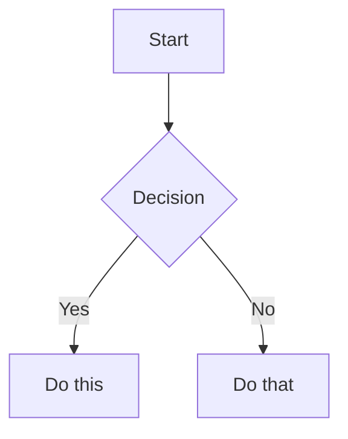

# Obsidian 风格 Markdown 技能

创建和编辑有效的 Obsidian 风格 Markdown。Obsidian 在 CommonMark 和 GFM 基础上扩展了 wikilinks、嵌入、标注、属性、注释等语法。本技能仅涵盖 Obsidian 特定的扩展——标准 Markdown（标题、粗体、斜体、列表、引用、代码块、表格）属于已知知识。

## 使用场景
- 编写或编辑面向 Obsidian 的 Markdown 笔记时使用。
- 任务涉及 wikilinks、嵌入、标注、frontmatter 属性或 Obsidian 特定语法时使用。
- 用户需要在 Obsidian vault 中正确渲染的笔记时使用。

## 工作流程：创建 Obsidian 笔记

1. **添加 frontmatter**，在文件顶部写入属性（title、tags、aliases）。参见 [PROPERTIES.md](references/PROPERTIES.md) 了解所有属性类型。
2. **编写内容**，使用标准 Markdown 构建结构，加上下方的 Obsidian 特定语法。
3. **链接相关笔记**，使用 wikilinks（`[[Note]]`）进行 vault 内部连接，或使用标准 Markdown 链接指向外部 URL。
4. **嵌入内容**，从其他笔记、图片或 PDF 嵌入，使用 `![[embed]]` 语法。参见 [EMBEDS.md](references/EMBEDS.md) 了解所有嵌入类型。
5. **添加标注**，使用 `> [!type]` 语法高亮信息。参见 [CALLOUTS.md](references/CALLOUTS.md) 了解所有标注类型。
6. **验证**笔记在 Obsidian 阅读视图中正确渲染。

> 在 wikilinks 和 Markdown 链接之间选择时：vault 内部笔记使用 `[[wikilinks]]`（Obsidian 会自动追踪重命名），外部 URL 使用普通 Markdown 链接。

## 内部链接（Wikilinks）

```markdown
[[Note Name]]                          Link to note
[[Note Name|Display Text]]             Custom display text
[[Note Name#Heading]]                  Link to heading
[[Note Name#^block-id]]                Link to block
[[#Heading in same note]]              Same-note heading link
```

通过在段落末尾追加 `^block-id` 来定义块 ID：

```markdown
This paragraph can be linked to. ^my-block-id
```

对于列表和引用，将块 ID 放在块之后的单独一行：

```markdown
> A quote block

^quote-id
```

## 嵌入

在任何 wikilink 前加 `!` 前缀即可内联嵌入其内容：

```markdown
![[Note Name]]                         Embed full note
![[Note Name#Heading]]                 Embed section
![[image.png]]                         Embed image
![[image.png|300]]                     Embed image with width
![[document.pdf#page=3]]               Embed PDF page
```

参见 [EMBEDS.md](references/EMBEDS.md) 了解音频、视频、搜索嵌入和外部图片。

## 标注

```markdown
> [!note]
> Basic callout.

> [!warning] Custom Title
> Callout with a custom title.

> [!faq]- Collapsed by default
> Foldable callout (- collapsed, + expanded).
```

常用类型：`note`、`tip`、`warning`、`info`、`example`、`quote`、`bug`、`danger`、`success`、`failure`、`question`、`abstract`、`todo`。

参见 [CALLOUTS.md](references/CALLOUTS.md) 了解完整列表，包括别名、嵌套和自定义 CSS 标注。

## 属性（Frontmatter）

```yaml
---
title: My Note
date: 2024-01-15
tags:
  - project
  - active
aliases:
  - Alternative Name
cssclasses:
  - custom-class
---
```

默认属性：`tags`（可搜索的标签）、`aliases`（用于链接建议的备选笔记名称）、`cssclasses`（用于样式的 CSS 类）。

参见 [PROPERTIES.md](references/PROPERTIES.md) 了解所有属性类型、标签语法规则和高级用法。

## 标签

```markdown
#tag                    Inline tag
#nested/tag             Nested tag with hierarchy
```

标签可包含字母、数字（不能作为首字符）、下划线、连字符和正斜杠。标签也可在 frontmatter 的 `tags` 属性中定义。

## 注释

```markdown
This is visible %%but this is hidden%% text.

%%
This entire block is hidden in reading view.
%%
```

## Obsidian 特定格式

```markdown
==Highlighted text==                   Highlight syntax
```

## 数学公式（LaTeX）

```markdown
Inline: $e^{i\pi} + 1 = 0$

Block:
$$
\frac{a}{b} = c
$$
```

## 图表（Mermaid）

````markdown

````

要将 Mermaid 节点链接到 Obsidian 笔记，添加 `class NodeName internal-link;`。

## 脚注

```markdown
Text with a footnote[^1].

[^1]: Footnote content.

Inline footnote.^[This is inline.]
```

## 完整示例

````markdown
---
title: Project Alpha
date: 2024-01-15
tags:
  - project
  - active
status: in-progress
---

# Project Alpha

This project aims to [[improve workflow]] using modern techniques.

> [!important] Key Deadline
> The first milestone is due on ==January 30th==.

## Tasks

- [x] Initial planning
- [ ] Development phase
  - [ ] Backend implementation
  - [ ] Frontend design

## Notes

The algorithm uses $O(n \log n)$ sorting. See [[Algorithm Notes#Sorting]] for details.

![[Architecture Diagram.png|600]]

Reviewed in [[Meeting Notes 2024-01-10#Decisions]].
````

## 参考资料

- [Obsidian Flavored Markdown](https://help.obsidian.md/obsidian-flavored-markdown)
- [Internal links](https://help.obsidian.md/links)
- [Embed files](https://help.obsidian.md/embeds)
- [Callouts](https://help.obsidian.md/callouts)
- [Properties](https://help.obsidian.md/properties)

## 限制
- 仅当任务明确匹配上述范围时才使用本技能。
- 不要将输出视为环境特定验证、测试或专家审查的替代品。
- 如果缺少所需输入、权限、安全边界或成功标准，请停下来请求澄清。
